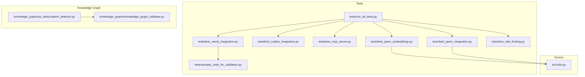
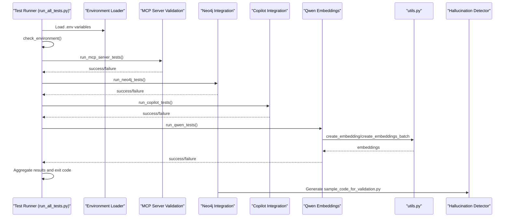
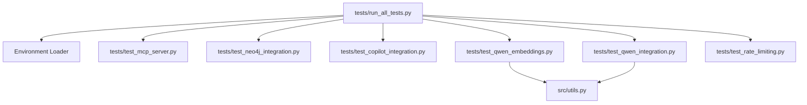

# Test Execution Framework

<cite>
**Referenced Files in This Document**
- [run_all_tests.py](file://tests/run_all_tests.py)
- [README.md](file://tests/README.md)
- [test_neo4j_integration.py](file://tests/test_neo4j_integration.py)
- [test_copilot_integration.py](file://tests/test_copilot_integration.py)
- [test_mcp_server.py](file://tests/test_mcp_server.py)
- [test_qwen_embeddings.py](file://tests/test_qwen_embeddings.py)
- [test_qwen_integration.py](file://tests/test_qwen_integration.py)
- [test_rate_limiting.py](file://tests/test_rate_limiting.py)
- [sample_code_for_validation.py](file://tests/sample_code_for_validation.py)
- [utils.py](file://src/utils.py)
- [pyproject.toml](file://pyproject.toml)
</cite>

## Table of Contents
1. [Introduction](#introduction)
2. [Project Structure](#project-structure)
3. [Core Components](#core-components)
4. [Architecture Overview](#architecture-overview)
5. [Detailed Component Analysis](#detailed-component-analysis)
6. [Dependency Analysis](#dependency-analysis)
7. [Performance Considerations](#performance-considerations)
8. [Troubleshooting Guide](#troubleshooting-guide)
9. [Conclusion](#conclusion)
10. [Appendices](#appendices)

## Introduction
This document explains the test execution framework for the project, focusing on how the test runner orchestrates the complete test suite, including execution order, error handling, and result aggregation. It also documents command-line usage, exit codes, logging behavior, and the role of sample_code_for_validation.py in providing test fixtures for code analysis and hallucination detection. Guidance is included for running subsets of tests, writing new test modules, integrating with CI/CD pipelines, preparing the environment, installing dependencies, and considerations for parallel test execution.

## Project Structure
The test suite is organized under the tests directory and integrates with knowledge graph modules for hallucination detection. The primary entry point is the test runner that coordinates multiple test suites and environment checks.

**Diagram sources**
- [run_all_tests.py](file://tests/run_all_tests.py#L1-L233)
- [test_neo4j_integration.py](file://tests/test_neo4j_integration.py#L1-L269)
- [test_copilot_integration.py](file://tests/test_copilot_integration.py#L1-L263)
- [test_mcp_server.py](file://tests/test_mcp_server.py#L1-L273)
- [test_qwen_embeddings.py](file://tests/test_qwen_embeddings.py#L1-L194)
- [test_qwen_integration.py](file://tests/test_qwen_integration.py#L1-L249)
- [test_rate_limiting.py](file://tests/test_rate_limiting.py#L1-L172)
- [sample_code_for_validation.py](file://tests/sample_code_for_validation.py#L1-L30)
- [utils.py](file://src/utils.py#L1-L200)
- [ai_hallucination_detector.py](file://knowledge_graphs/ai_hallucination_detector.py#L1-L335)
- [knowledge_graph_validator.py](file://knowledge_graphs/knowledge_graph_validator.py#L1-L800)

**Section sources**
- [run_all_tests.py](file://tests/run_all_tests.py#L1-L233)
- [README.md](file://tests/README.md#L1-L212)

## Core Components
- Test Runner: Orchestrates environment checks, MCP server validation, Neo4j integration, Copilot integration, and Qwen embedding tests. Aggregates results and exits with appropriate status codes.
- Environment Loader: Loads variables from a .env file and prints status; CLI overrides take precedence.
- Test Suites:
  - Neo4j Integration: Connection, module imports, repository parsing, query operations, and sample code generation.
  - Copilot Integration: Embeddings, chat completions, utils integration, and fallback behavior.
  - MCP Server Validation: Process check, configuration, database, AI providers, RAG features, tools availability, and rate limiting.
  - Qwen Embeddings: Unit tests for model loading, single/batch embeddings, similarity, fallback behavior, and error handling.
  - Qwen Integration: End-to-end tests for document processing and search using Qwen embeddings.
  - Rate Limiting: Tests for rate limiter, exponential backoff, burst protection, and Copilot client integration.
- Sample Code Fixture: Generates a sample Python script for hallucination detection after Neo4j tests.

Key behaviors:
- Execution order is deterministic: MCP server validation, Neo4j, Copilot, Qwen.
- Error handling: Exceptions are caught per suite; failures are reported and do not stop other suites.
- Result aggregation: Prints a summary of passed/failed suites and exits with code 0 on success, 1 otherwise.
- Logging: Console logs indicate progress and outcomes; Qwen tests print model availability and fallback behavior.

**Section sources**
- [run_all_tests.py](file://tests/run_all_tests.py#L1-L233)
- [test_neo4j_integration.py](file://tests/test_neo4j_integration.py#L1-L269)
- [test_copilot_integration.py](file://tests/test_copilot_integration.py#L1-L263)
- [test_mcp_server.py](file://tests/test_mcp_server.py#L1-L273)
- [test_qwen_embeddings.py](file://tests/test_qwen_embeddings.py#L1-L194)
- [test_qwen_integration.py](file://tests/test_qwen_integration.py#L1-L249)
- [test_rate_limiting.py](file://tests/test_rate_limiting.py#L1-L172)
- [sample_code_for_validation.py](file://tests/sample_code_for_validation.py#L1-L30)

## Architecture Overview
The test runner coordinates multiple test suites and integrates with shared utilities and knowledge graph components.

**Diagram sources**
- [run_all_tests.py](file://tests/run_all_tests.py#L1-L233)
- [test_mcp_server.py](file://tests/test_mcp_server.py#L1-L273)
- [test_neo4j_integration.py](file://tests/test_neo4j_integration.py#L1-L269)
- [test_copilot_integration.py](file://tests/test_copilot_integration.py#L1-L263)
- [test_qwen_embeddings.py](file://tests/test_qwen_embeddings.py#L1-L194)
- [test_qwen_integration.py](file://tests/test_qwen_integration.py#L1-L249)
- [utils.py](file://src/utils.py#L121-L197)
- [sample_code_for_validation.py](file://tests/sample_code_for_validation.py#L1-L30)

## Detailed Component Analysis

### Test Runner Orchestration (run_all_tests.py)
Responsibilities:
- Loads environment variables from .env if present.
- Performs environment configuration checks for critical variables.
- Executes suites in a fixed order: MCP server validation, Neo4j, Copilot, Qwen.
- Aggregates results and prints a summary.
- Exits with code 0 on success, 1 on failure.

Execution order and control flow:
- Environment check runs first; if missing critical variables, the runner exits early.
- Each suite is executed in sequence; exceptions are caught and reported.
- Qwen tests use pytest for selected files and fall back to a basic embedding test if pytest is unavailable.

Exit codes:
- Returns True (exit 0) when all suites pass; otherwise returns False (exit 1).

Logging behavior:
- Prints section headers and outcomes for each suite.
- Indicates whether pytest is available and whether sentence-transformers is installed.

**Section sources**
- [run_all_tests.py](file://tests/run_all_tests.py#L1-L233)

### Neo4j Integration Tests (test_neo4j_integration.py)
Responsibilities:
- Validates Neo4j connection and version.
- Imports knowledge graph modules and ensures they are available.
- Demonstrates repository parsing capability.
- Performs read/write operations and cleans up test nodes.
- Generates a sample Python script for hallucination detection.

Role of sample_code_for_validation.py:
- Created by the Neo4j integration test to provide a fixture for hallucination detection.
- The generated file is placed in the tests directory and can be used with the hallucination detector.

Next steps guidance:
- Parses repositories into the knowledge graph.
- Queries the knowledge graph.
- Uses the hallucination detector with the generated sample file.

**Section sources**
- [test_neo4j_integration.py](file://tests/test_neo4j_integration.py#L1-L269)
- [sample_code_for_validation.py](file://tests/sample_code_for_validation.py#L1-L30)

### Copilot Integration Tests (test_copilot_integration.py)
Responsibilities:
- Tests GitHub Copilot embedding client initialization and single/batch embeddings.
- Tests chat completion with a specified model.
- Validates utils integration for embeddings and chat completions.
- Tests fallback behavior when Copilot is unavailable by switching to OpenAI.

Key behaviors:
- Skips tests when required environment variables are not set.
- Uses pytest markers and async test functions.
- Provides a full integration test entry point.

**Section sources**
- [test_copilot_integration.py](file://tests/test_copilot_integration.py#L1-L263)

### MCP Server Validation Tests (test_mcp_server.py)
Responsibilities:
- Verifies MCP server process is running.
- Validates server configuration (transport, host, port).
- Checks database configuration for Supabase and Neo4j.
- Validates AI provider configuration for GitHub Copilot and OpenAI.
- Confirms RAG features and tools availability.
- Tests rate limiting configuration.

Output:
- Prints a validation summary and returns success if all required checks pass.

**Section sources**
- [test_mcp_server.py](file://tests/test_mcp_server.py#L1-L273)

### Qwen Embeddings Tests (test_qwen_embeddings.py)
Responsibilities:
- Unit tests for Qwen model loading and single/batch embeddings.
- Tests embedding similarity and fallback behavior when the model is not available.
- Tests error handling and empty input handling.
- Uses mocks to simulate model unavailability and exceptions.

**Section sources**
- [test_qwen_embeddings.py](file://tests/test_qwen_embeddings.py#L1-L194)

### Qwen Integration Tests (test_qwen_integration.py)
Responsibilities:
- Integration tests for Qwen embeddings in document processing and search.
- Validates that Qwen embeddings are used when enabled and that batch processing is efficient.
- Tests environment variable precedence so Qwen takes precedence over other embedding methods.

**Section sources**
- [test_qwen_integration.py](file://tests/test_qwen_integration.py#L1-L249)

### Rate Limiting Tests (test_rate_limiting.py)
Responsibilities:
- Tests rate limiter behavior, exponential backoff, and burst protection.
- Validates Copilot client rate limiting integration.
- Demonstrates configuration via environment variables.

**Section sources**
- [test_rate_limiting.py](file://tests/test_rate_limiting.py#L1-L172)

### Sample Code for Validation (tests/sample_code_for_validation.py)
Role:
- Provides a sample Python script that uses real methods (requests, json) to serve as a baseline for hallucination detection.
- Generated by the Neo4j integration test to demonstrate downstream usage with the hallucination detector.

**Section sources**
- [sample_code_for_validation.py](file://tests/sample_code_for_validation.py#L1-L30)

## Dependency Analysis
- Test Runner depends on:
  - Environment loader and environment checks.
  - Individual test modules for Neo4j, Copilot, MCP server, Qwen, and rate limiting.
- Qwen tests depend on utils.py for embedding creation and fallback behavior.
- Knowledge graph components (hallucination detector and validator) are used indirectly by the Neo4j integration test’s generated sample code.

**Diagram sources**
- [run_all_tests.py](file://tests/run_all_tests.py#L1-L233)
- [test_mcp_server.py](file://tests/test_mcp_server.py#L1-L273)
- [test_neo4j_integration.py](file://tests/test_neo4j_integration.py#L1-L269)
- [test_copilot_integration.py](file://tests/test_copilot_integration.py#L1-L263)
- [test_qwen_embeddings.py](file://tests/test_qwen_embeddings.py#L1-L194)
- [test_qwen_integration.py](file://tests/test_qwen_integration.py#L1-L249)
- [test_rate_limiting.py](file://tests/test_rate_limiting.py#L1-L172)
- [utils.py](file://src/utils.py#L121-L197)

**Section sources**
- [run_all_tests.py](file://tests/run_all_tests.py#L1-L233)
- [utils.py](file://src/utils.py#L121-L197)

## Performance Considerations
- Qwen embedding tests may skip if sentence-transformers is not installed; this avoids heavy model loading overhead.
- The test runner aggregates results and does not enforce parallelism; running suites sequentially simplifies debugging and resource usage.
- Rate limiting tests validate burst protection and backoff behavior, which can inform CI scheduling and concurrency policies.

[No sources needed since this section provides general guidance]

## Troubleshooting Guide
Common issues and resolutions:
- Missing environment variables: Ensure NEO4J_URI, NEO4J_USER, NEO4J_PASSWORD, USE_KNOWLEDGE_GRAPH, GITHUB_TOKEN, OPENAI_API_KEY, USE_COPILOT_EMBEDDINGS, USE_COPILOT_CHAT, USE_QWEN_EMBEDDINGS are set. The runner prints which variables are missing.
- Neo4j connection failures: Confirm the database is running locally and credentials are correct.
- Copilot tests skipped: Set GITHUB_TOKEN and ensure a valid subscription; tests skip if the token is missing.
- Qwen tests skipped: Install sentence-transformers; otherwise, the runner falls back to basic embedding tests.
- pytest not available: The runner falls back to a basic Qwen test; install pytest for full coverage.
- MCP server not running: Start the server process before running MCP validation tests.

Developer guidance:
- Run subsets of tests:
  - Use pytest to run specific test files or groups.
  - Run the test runner to execute all suites in order.
- Writing new test modules:
  - Follow naming convention test_*.py.
  - Include both unit and integration tests.
  - Add pytest markers (@pytest.mark.integration) for integration tests.
  - Update tests/README.md with new test descriptions.
  - Ensure tests can be run both individually and via the test runner.
- CI/CD integration:
  - Set required environment variables in CI.
  - Invoke the test runner; it exits with code 0 on success and 1 on failure.

**Section sources**
- [README.md](file://tests/README.md#L1-L212)
- [run_all_tests.py](file://tests/run_all_tests.py#L1-L233)

## Conclusion
The test execution framework provides a robust, ordered orchestration of integration tests with clear environment checks, error handling, and result aggregation. It supports both pytest-driven and custom test execution paths, offers guidance for running subsets and writing new tests, and integrates with knowledge graph components for hallucination detection. Developers can rely on the runner for local development and CI/CD pipelines, with predictable exit codes and informative logs.

[No sources needed since this section summarizes without analyzing specific files]

## Appendices

### Command-Line Usage and Exit Codes
- Run the full test suite:
  - From project root, invoke the test runner; it auto-loads .env variables.
  - Override specific variables via environment variables before invocation.
- Run individual test suites:
  - Directly execute test files; they auto-load .env when run standalone.
- Run with pytest:
  - Install pytest and pytest-asyncio.
  - Use pytest commands to run all tests, specific files, or tagged groups.
- Exit codes:
  - 0 on success (all suites passed).
  - 1 on failure (some suites failed).

**Section sources**
- [README.md](file://tests/README.md#L50-L120)
- [run_all_tests.py](file://tests/run_all_tests.py#L224-L233)

### Environment Preparation and Dependencies
- Required environment variables:
  - Neo4j: NEO4J_URI, NEO4J_USER, NEO4J_PASSWORD, USE_KNOWLEDGE_GRAPH.
  - AI providers: GITHUB_TOKEN (for Copilot) or OPENAI_API_KEY (for fallback).
  - Qwen: USE_QWEN_EMBEDDINGS.
  - MCP server: TRANSPORT, HOST, PORT, SUPABASE_URL, SUPABASE_SERVICE_KEY, and knowledge graph flags.
- Dependencies:
  - sentence-transformers for Qwen embeddings.
  - pytest and pytest-asyncio for pytest-based tests.
  - Python 3.12+.

**Section sources**
- [README.md](file://tests/README.md#L20-L49)
- [pyproject.toml](file://pyproject.toml#L1-L40)

### Parallel Test Execution Considerations
- The test runner executes suites sequentially and does not enforce parallelism.
- For parallel execution in CI:
  - Split tests across jobs (e.g., separate jobs for Neo4j, Copilot, Qwen).
  - Ensure each job sets the required environment variables.
  - Use pytest-xdist for parallel pytest runs if desired, while maintaining isolation of shared resources (e.g., Neo4j).

[No sources needed since this section provides general guidance]