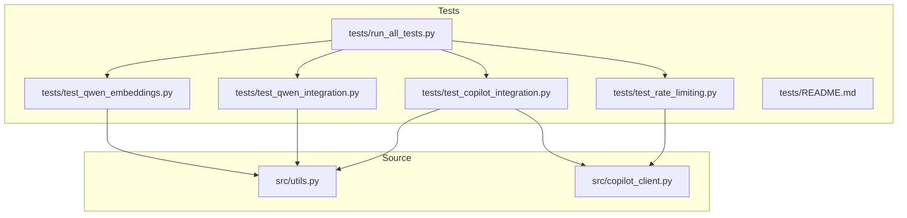
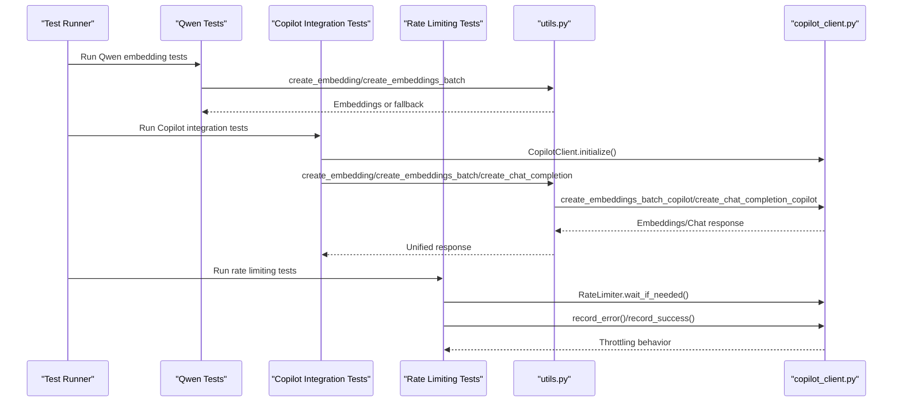
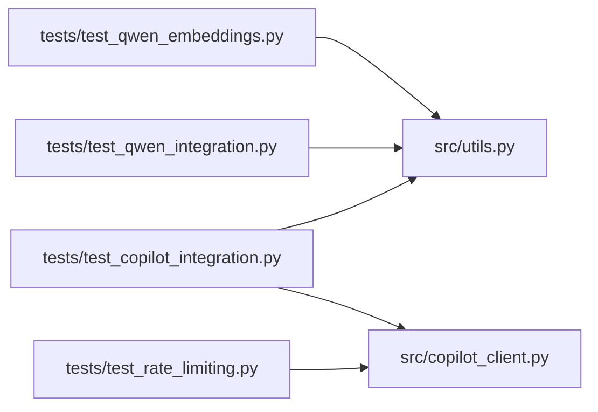

# Unit Testing

<cite>
**Referenced Files in This Document**
- [tests/test_qwen_embeddings.py](file://tests/test_qwen_embeddings.py)
- [tests/test_qwen_integration.py](file://tests/test_qwen_integration.py)
- [tests/test_copilot_integration.py](file://tests/test_copilot_integration.py)
- [tests/test_rate_limiting.py](file://tests/test_rate_limiting.py)
- [tests/run_all_tests.py](file://tests/run_all_tests.py)
- [tests/README.md](file://tests/README.md)
- [src/utils.py](file://src/utils.py)
- [src/copilot_client.py](file://src/copilot_client.py)
</cite>

## Table of Contents
1. [Introduction](#introduction)
2. [Project Structure](#project-structure)
3. [Core Components](#core-components)
4. [Architecture Overview](#architecture-overview)
5. [Detailed Component Analysis](#detailed-component-analysis)
6. [Dependency Analysis](#dependency-analysis)
7. [Performance Considerations](#performance-considerations)
8. [Troubleshooting Guide](#troubleshooting-guide)
9. [Conclusion](#conclusion)

## Introduction
This document explains the unit and integration testing strategy for validating isolated components and cross-cutting concerns such as Qwen embedding generation, Copilot client integration, and rate limiting logic. It covers the purpose and scope of each test file, the testing frameworks and assertion patterns used, and provides examples of mock implementations for external AI providers and environment variable handling. It also outlines best practices for writing effective unit tests, including test isolation, dependency mocking, and edge case coverage, and addresses common pitfalls and debugging techniques when tests fail.

## Project Structure
The testing effort is organized around focused test modules under the tests directory, each validating a specific aspect of the system:
- Qwen embedding unit tests validate model loading, single and batch embedding creation, similarity behavior, fallback behavior, empty input handling, and error handling.
- Qwen integration tests validate end-to-end behavior within the broader pipeline (document processing and search) and environment precedence.
- Copilot integration tests validate client initialization, embedding and chat completion flows, unified utils integration, and fallback behavior to OpenAI.
- Rate limiting tests validate the RateLimiter’s behavior for requests-per-minute, burst protection, and exponential backoff on errors, and integrate with the Copilot client.

**Diagram sources**
- [tests/test_qwen_embeddings.py](file://tests/test_qwen_embeddings.py#L1-L194)
- [tests/test_qwen_integration.py](file://tests/test_qwen_integration.py#L1-L249)
- [tests/test_copilot_integration.py](file://tests/test_copilot_integration.py#L1-L263)
- [tests/test_rate_limiting.py](file://tests/test_rate_limiting.py#L1-L172)
- [tests/run_all_tests.py](file://tests/run_all_tests.py#L1-L233)
- [src/utils.py](file://src/utils.py#L1-L1187)
- [src/copilot_client.py](file://src/copilot_client.py#L1-L560)

**Section sources**
- [tests/README.md](file://tests/README.md#L1-L212)
- [tests/run_all_tests.py](file://tests/run_all_tests.py#L1-L233)

## Core Components
- Qwen embedding generation
  - Purpose: Validate local Qwen model loading, single and batch embedding creation, dimension consistency, similarity behavior, fallback to zero embeddings, empty input handling, and error handling.
  - Scope: Isolated unit tests in test_qwen_embeddings.py and integration-style tests in test_qwen_integration.py that exercise the full pipeline via utils.
- Copilot client integration
  - Purpose: Validate Copilot client initialization, embedding and chat completion flows, unified utils integration, and fallback behavior to OpenAI when credentials are missing.
  - Scope: Integration tests in test_copilot_integration.py that orchestrate client initialization and end-to-end flows.
- Rate limiting logic
  - Purpose: Validate RateLimiter behavior for requests-per-minute, burst protection, and exponential backoff on errors, and ensure it integrates with the Copilot client.
  - Scope: Unit tests in test_rate_limiting.py that instantiate RateLimiter and CopilotClient and assert timing and backoff behavior.

**Section sources**
- [tests/test_qwen_embeddings.py](file://tests/test_qwen_embeddings.py#L1-L194)
- [tests/test_qwen_integration.py](file://tests/test_qwen_integration.py#L1-L249)
- [tests/test_copilot_integration.py](file://tests/test_copilot_integration.py#L1-L263)
- [tests/test_rate_limiting.py](file://tests/test_rate_limiting.py#L1-L172)

## Architecture Overview
The tests validate the following interactions:
- Qwen embedding path: tests call utils functions that conditionally delegate to Qwen, Copilot, or OpenAI based on environment variables.
- Copilot client path: tests instantiate CopilotClient, initialize tokens, and call embedding and chat completion endpoints, with rate limiting integrated.
- Rate limiting path: tests validate RateLimiter logic and its integration with CopilotClient.

**Diagram sources**
- [tests/test_qwen_embeddings.py](file://tests/test_qwen_embeddings.py#L1-L194)
- [tests/test_qwen_integration.py](file://tests/test_qwen_integration.py#L1-L249)
- [tests/test_copilot_integration.py](file://tests/test_copilot_integration.py#L1-L263)
- [tests/test_rate_limiting.py](file://tests/test_rate_limiting.py#L1-L172)
- [src/utils.py](file://src/utils.py#L121-L317)
- [src/copilot_client.py](file://src/copilot_client.py#L183-L385)

## Detailed Component Analysis

### Qwen Embedding Unit Tests
Scope and purpose:
- Validate Qwen model availability and lazy loading behavior.
- Validate single and batch embedding creation, dimension consistency, and similarity behavior.
- Validate fallback to zero embeddings when the model is unavailable.
- Validate empty input handling and error handling behavior.

Key testing patterns:
- Environment fixture to enable Qwen embeddings for the test session.
- Conditional skips when sentence-transformers is not installed.
- Assertions on embedding shape, element types, and dimension uniformity.
- Cosine similarity assertions for similar vs. dissimilar texts.
- Mocking model failures to verify fallback behavior and error logging.

Mock examples:
- Patch get_qwen_embedding_model to return None to trigger fallback to zero embeddings.
- Patch built-in print to assert error logging behavior.

Best practices demonstrated:
- Test isolation via environment fixtures.
- Edge case coverage for empty inputs and model failures.
- Deterministic assertions on embedding dimensions and similarity ordering.

Common pitfalls:
- Assuming model availability; always guard with import checks and skip conditions.
- Not verifying fallback dimensions; ensure fallback returns the expected dimensionality.

**Section sources**
- [tests/test_qwen_embeddings.py](file://tests/test_qwen_embeddings.py#L1-L194)
- [src/utils.py](file://src/utils.py#L34-L105)

### Qwen Integration Tests
Scope and purpose:
- Validate Qwen embeddings within the broader pipeline: document ingestion and search.
- Validate environment variable precedence: Qwen should take precedence over Copilot/OpenAI when enabled.
- Validate performance parity between single and batch embeddings.

Key testing patterns:
- Environment fixtures to enable Qwen and disable Copilot.
- Mocking Supabase client to isolate the embedding pipeline.
- Parameterized tests for varying text lengths.
- Assertions on RPC calls and parameter shapes for search.

Mock examples:
- Mock Supabase client.table().rpc().execute to return mock results for search.
- Mock create_embeddings_batch_qwen to force deterministic outputs for precedence tests.

Best practices demonstrated:
- End-to-end validation via utils functions.
- Parameterized tests for robustness across input sizes.
- Precedence verification by patching environment variables and targeted functions.

Common pitfalls:
- Assuming model availability; ensure skip conditions mirror production fallbacks.
- Not accounting for contextual embeddings toggle affecting pipeline behavior.

**Section sources**
- [tests/test_qwen_integration.py](file://tests/test_qwen_integration.py#L1-L249)
- [src/utils.py](file://src/utils.py#L121-L317)

### Copilot Integration Tests
Scope and purpose:
- Validate Copilot client initialization and token acquisition.
- Validate single and batch embedding creation and chat completion flows.
- Validate unified utils integration for embeddings and chat completion.
- Validate fallback behavior to OpenAI when Copilot credentials are missing.

Key testing patterns:
- Environment fixture to enable Copilot embeddings and chat.
- Conditional skips when GITHUB_TOKEN is not set.
- Async test patterns using pytest-asyncio.
- Assertions on response shapes and dimensions.

Mock examples:
- Directly instantiate CopilotClient with a token and assert initialization success.
- Use environment variables to switch between Copilot and OpenAI fallbacks.

Best practices demonstrated:
- Async test design for client operations.
- Clear separation between client-level and utils-level integration.
- Robust fallback validation to ensure resilience.

Common pitfalls:
- Missing GITHUB_TOKEN causing tests to skip; ensure environment is configured or skip gracefully.
- Not handling token expiration retries in tests; rely on client-side retry logic.

**Section sources**
- [tests/test_copilot_integration.py](file://tests/test_copilot_integration.py#L1-L263)
- [src/copilot_client.py](file://src/copilot_client.py#L108-L385)
- [src/utils.py](file://src/utils.py#L198-L317)

### Rate Limiting Tests
Scope and purpose:
- Validate RateLimiter behavior for requests-per-minute, burst protection, and exponential backoff on errors.
- Validate integration with CopilotClient to ensure throttling and backoff are applied during API calls.

Key testing patterns:
- Instantiate RateLimiter with restrictive limits for controlled tests.
- Simulate consecutive errors and assert backoff growth.
- Measure wait times and total durations to confirm throttling behavior.
- Integrate with CopilotClient to validate real-world usage.

Mock examples:
- Use RateLimiter directly in unit tests.
- Integrate with CopilotClient to validate wait_if_needed and error recording.

Best practices demonstrated:
- Controlled throttling scenarios to validate timing and backoff.
- Real client integration to ensure end-to-end correctness.

Common pitfalls:
- Not accounting for burst windows; ensure burst limit is respected within 10-second intervals.
- Over-reliance on exact timing; prefer bounds and ratios for robust assertions.

**Section sources**
- [tests/test_rate_limiting.py](file://tests/test_rate_limiting.py#L1-L172)
- [src/copilot_client.py](file://src/copilot_client.py#L19-L108)

## Dependency Analysis
The tests depend on the following modules and their exported functions:
- utils.py: embedding creation functions, chat completion, and environment-driven selection among Qwen, Copilot, and OpenAI.
- copilot_client.py: CopilotClient and RateLimiter classes, plus synchronous wrappers for Copilot operations.

**Diagram sources**
- [tests/test_qwen_embeddings.py](file://tests/test_qwen_embeddings.py#L1-L194)
- [tests/test_qwen_integration.py](file://tests/test_qwen_integration.py#L1-L249)
- [tests/test_copilot_integration.py](file://tests/test_copilot_integration.py#L1-L263)
- [tests/test_rate_limiting.py](file://tests/test_rate_limiting.py#L1-L172)
- [src/utils.py](file://src/utils.py#L121-L317)
- [src/copilot_client.py](file://src/copilot_client.py#L183-L385)

**Section sources**
- [src/utils.py](file://src/utils.py#L121-L317)
- [src/copilot_client.py](file://src/copilot_client.py#L19-L108)

## Performance Considerations
- Prefer batch embedding operations over repeated single calls when processing multiple texts to reduce overhead.
- Validate performance parity between single and batch operations to ensure deterministic behavior.
- Use parameterized tests to assess behavior across varied input sizes and ensure consistent dimensions.

[No sources needed since this section provides general guidance]

## Troubleshooting Guide
Common issues and debugging techniques:
- Missing dependencies
  - Symptom: Tests skip with import-related messages.
  - Action: Install sentence-transformers for Qwen tests and pytest-asyncio for Copilot tests.
- Missing environment variables
  - Symptom: Tests skip due to missing GITHUB_TOKEN or OPENAI_API_KEY.
  - Action: Configure environment variables or use the test runner’s .env loading mechanism.
- Model unavailability
  - Symptom: Dummy zero embeddings returned.
  - Action: Verify model installation and device availability; tests include fallback behavior to ensure resilience.
- Rate limiting behavior
  - Symptom: Delays or backoff observed in tests.
  - Action: Confirm RateLimiter configuration and ensure integration with CopilotClient is intact.

**Section sources**
- [tests/test_qwen_embeddings.py](file://tests/test_qwen_embeddings.py#L1-L194)
- [tests/test_copilot_integration.py](file://tests/test_copilot_integration.py#L1-L263)
- [tests/test_rate_limiting.py](file://tests/test_rate_limiting.py#L1-L172)
- [tests/README.md](file://tests/README.md#L166-L212)

## Conclusion
The test suite provides comprehensive validation for Qwen embedding generation, Copilot client integration, and rate limiting logic. By isolating components, mocking external dependencies, and asserting environment-driven behavior, the tests ensure reliability and resilience across different provider backends. Following the outlined best practices and troubleshooting steps will help maintain high-quality unit tests and smooth development workflows.