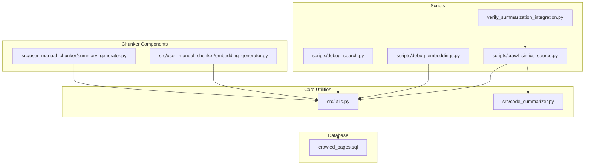
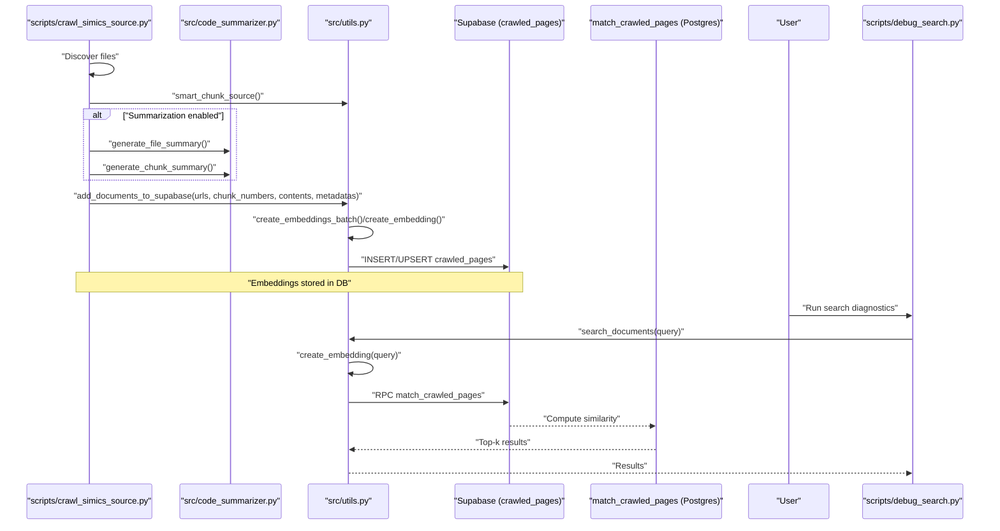
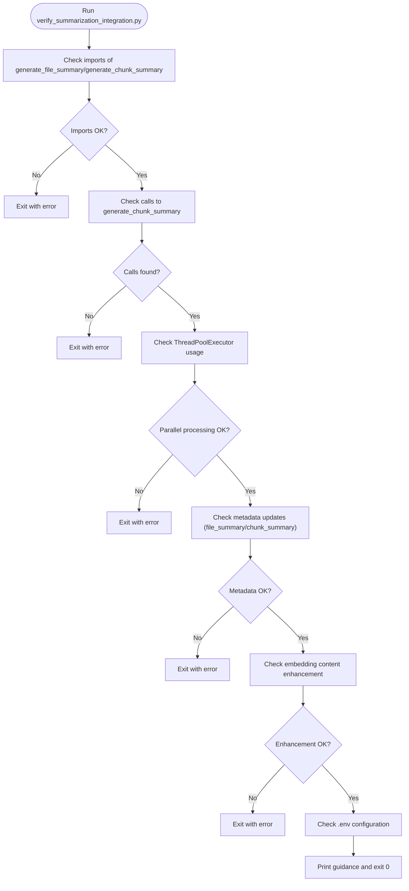
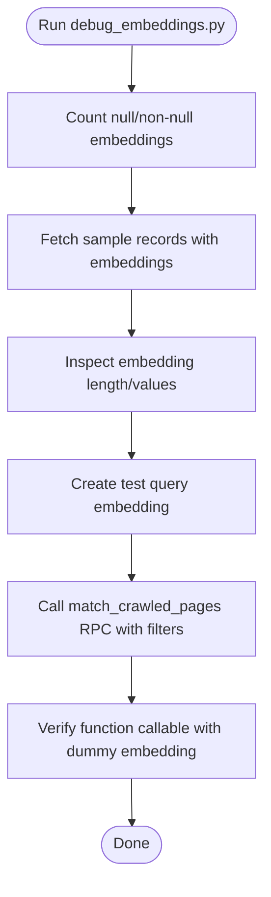
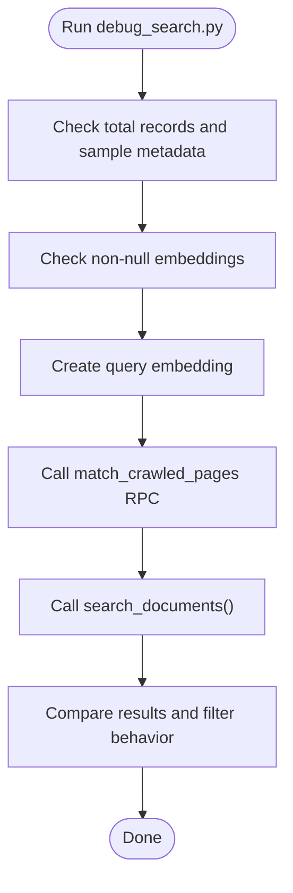
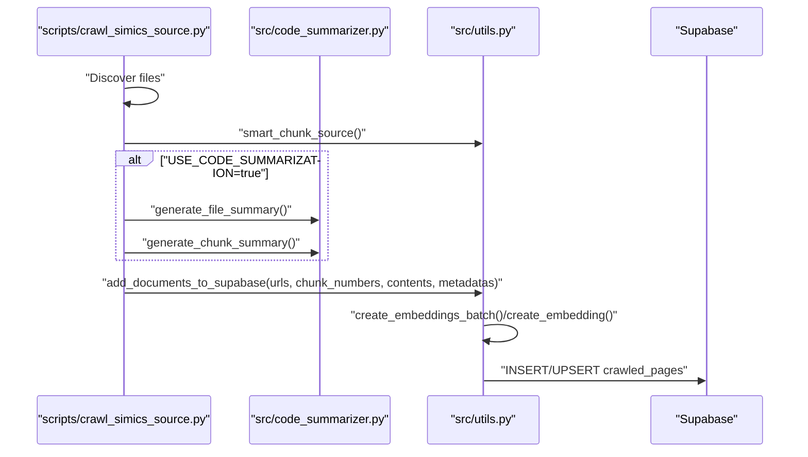
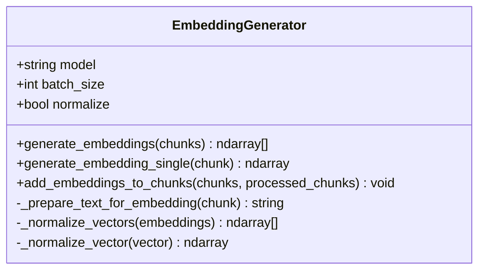
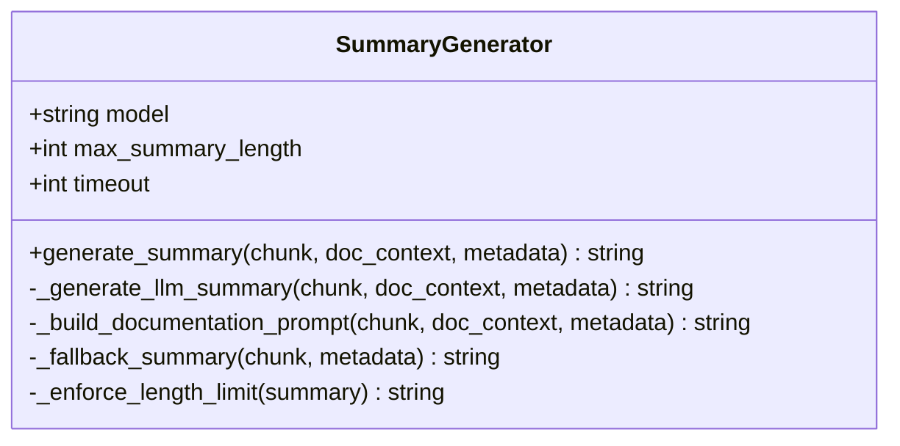
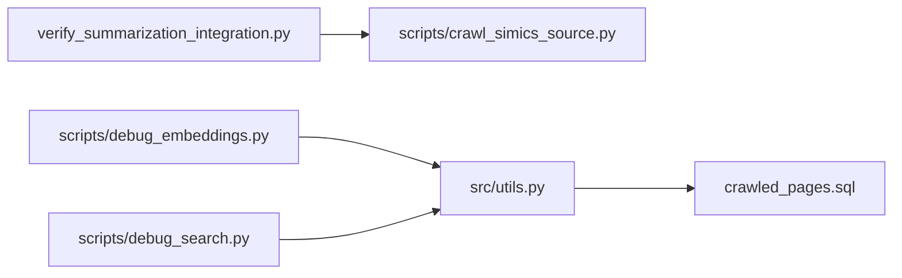

# Verification Workflows

<cite>
**Referenced Files in This Document**
- [verify_summarization_integration.py](file://verify_summarization_integration.py)
- [scripts/crawl_simics_source.py](file://scripts/crawl_simics_source.py)
- [scripts/debug_embeddings.py](file://scripts/debug_embeddings.py)
- [scripts/debug_search.py](file://scripts/debug_search.py)
- [src/utils.py](file://src/utils.py)
- [src/code_summarizer.py](file://src/code_summarizer.py)
- [src/user_manual_chunker/embedding_generator.py](file://src/user_manual_chunker/embedding_generator.py)
- [src/user_manual_chunker/summary_generator.py](file://src/user_manual_chunker/summary_generator.py)
- [crawled_pages.sql](file://crawled_pages.sql)
- [tests/run_all_tests.py](file://tests/run_all_tests.py)
</cite>

## Table of Contents
1. [Introduction](#introduction)
2. [Project Structure](#project-structure)
3. [Core Components](#core-components)
4. [Architecture Overview](#architecture-overview)
5. [Detailed Component Analysis](#detailed-component-analysis)
6. [Dependency Analysis](#dependency-analysis)
7. [Performance Considerations](#performance-considerations)
8. [Troubleshooting Guide](#troubleshooting-guide)
9. [Conclusion](#conclusion)
10. [Appendices](#appendices)

## Introduction
This document explains verification workflows that ensure system correctness beyond automated tests. It focuses on:
- Purpose and usage of verify_summarization_integration.py to validate end-to-end summarization pipelines
- How debug_embeddings.py and debug_search.py assist in diagnosing embedding generation and retrieval issues
- Step-by-step debugging procedures for Retrieval-Augmented Generation (RAG) pipelines
- Practical examples for troubleshooting real-world problems
- Tips for interpreting output logs and identifying data drift or model degradation

## Project Structure
The verification workflow spans scripts, utilities, and database functions:
- Scripts orchestrate ingestion and summarization
- Utilities provide embedding creation, search, and database helpers
- Database schema defines vector similarity search and indexes
- Summarization modules generate file and chunk summaries

**Diagram sources**
- [verify_summarization_integration.py](file://verify_summarization_integration.py#L1-L143)
- [scripts/crawl_simics_source.py](file://scripts/crawl_simics_source.py#L1-L642)
- [scripts/debug_embeddings.py](file://scripts/debug_embeddings.py#L1-L107)
- [scripts/debug_search.py](file://scripts/debug_search.py#L1-L95)
- [src/utils.py](file://src/utils.py#L1-L800)
- [src/code_summarizer.py](file://src/code_summarizer.py#L1-L317)
- [src/user_manual_chunker/embedding_generator.py](file://src/user_manual_chunker/embedding_generator.py#L1-L213)
- [src/user_manual_chunker/summary_generator.py](file://src/user_manual_chunker/summary_generator.py#L1-L330)
- [crawled_pages.sql](file://crawled_pages.sql#L36-L83)

**Section sources**
- [verify_summarization_integration.py](file://verify_summarization_integration.py#L1-L143)
- [scripts/crawl_simics_source.py](file://scripts/crawl_simics_source.py#L1-L642)
- [src/utils.py](file://src/utils.py#L1-L800)
- [crawled_pages.sql](file://crawled_pages.sql#L36-L83)

## Core Components
- verify_summarization_integration.py validates that summarization is integrated into the ingestion pipeline, including imports, function calls, parallel processing, metadata updates, and embedding content enhancement.
- debug_embeddings.py inspects embedding counts, samples, and performs direct searches against the vector function to isolate issues with embeddings or search parameters.
- debug_search.py checks database state, verifies embeddings, and exercises both direct RPC and utility search functions to diagnose retrieval failures.
- src/utils.py centralizes embedding creation, contextual embedding, Supabase operations, and search logic used by both scripts and ingestion.
- src/code_summarizer.py provides file-level and chunk-level summarization used during ingestion.
- src/user_manual_chunker components demonstrate embedding generation and summary generation patterns applicable to broader pipelines.

**Section sources**
- [verify_summarization_integration.py](file://verify_summarization_integration.py#L1-L143)
- [scripts/debug_embeddings.py](file://scripts/debug_embeddings.py#L1-L107)
- [scripts/debug_search.py](file://scripts/debug_search.py#L1-L95)
- [src/utils.py](file://src/utils.py#L1-L800)
- [src/code_summarizer.py](file://src/code_summarizer.py#L1-L317)
- [src/user_manual_chunker/embedding_generator.py](file://src/user_manual_chunker/embedding_generator.py#L1-L213)
- [src/user_manual_chunker/summary_generator.py](file://src/user_manual_chunker/summary_generator.py#L1-L330)

## Architecture Overview
The end-to-end ingestion and search pipeline:
- Ingestion script discovers source files, chunks content, optionally generates summaries, prepares embedding content, and uploads to Supabase
- Vector search is performed via a Postgres function that computes cosine distance and applies filters
- Debugging scripts probe embeddings and search behavior independently

**Diagram sources**
- [scripts/crawl_simics_source.py](file://scripts/crawl_simics_source.py#L220-L420)
- [src/code_summarizer.py](file://src/code_summarizer.py#L27-L140)
- [src/utils.py](file://src/utils.py#L548-L587)
- [crawled_pages.sql](file://crawled_pages.sql#L46-L83)
- [scripts/debug_search.py](file://scripts/debug_search.py#L1-L95)

## Detailed Component Analysis

### verify_summarization_integration.py
Purpose:
- Validates that the ingestion pipeline integrates summarization and metadata updates, and that parallel processing is used.

Key checks:
- Imports and usage of generate_file_summary and generate_chunk_summary
- Parallel processing with ThreadPoolExecutor
- Metadata fields file_summary and chunk_summary
- Enhancement of embedding content with file and chunk summaries
- Configuration checks for environment variables

Usage:
- Run the script to verify that the ingestion pipeline in scripts/crawl_simics_source.py is correctly wired.

**Diagram sources**
- [verify_summarization_integration.py](file://verify_summarization_integration.py#L1-L143)
- [scripts/crawl_simics_source.py](file://scripts/crawl_simics_source.py#L295-L370)

**Section sources**
- [verify_summarization_integration.py](file://verify_summarization_integration.py#L1-L143)
- [scripts/crawl_simics_source.py](file://scripts/crawl_simics_source.py#L295-L370)

### debug_embeddings.py
Purpose:
- Inspect embedding statistics, sample embeddings, and exercise direct vector search RPC calls to isolate issues with embeddings or search parameters.

Typical diagnostics:
- Count null vs non-null embeddings
- Inspect embedding shape and values
- Attempt direct RPC calls with various filters
- Verify function existence and callability

**Diagram sources**
- [scripts/debug_embeddings.py](file://scripts/debug_embeddings.py#L1-L107)
- [src/utils.py](file://src/utils.py#L548-L587)
- [crawled_pages.sql](file://crawled_pages.sql#L46-L83)

**Section sources**
- [scripts/debug_embeddings.py](file://scripts/debug_embeddings.py#L1-L107)
- [src/utils.py](file://src/utils.py#L548-L587)
- [crawled_pages.sql](file://crawled_pages.sql#L46-L83)

### debug_search.py
Purpose:
- Verify database state, check embeddings, and test both direct RPC and utility search functions to troubleshoot why vector search returns unexpected results.

Typical diagnostics:
- Confirm presence of records and sample metadata
- Check embeddings existence and validity
- Create query embedding and compare results across filters
- Compare direct RPC and search_documents behavior

**Diagram sources**
- [scripts/debug_search.py](file://scripts/debug_search.py#L1-L95)
- [src/utils.py](file://src/utils.py#L548-L587)
- [crawled_pages.sql](file://crawled_pages.sql#L46-L83)

**Section sources**
- [scripts/debug_search.py](file://scripts/debug_search.py#L1-L95)
- [src/utils.py](file://src/utils.py#L548-L587)
- [crawled_pages.sql](file://crawled_pages.sql#L46-L83)

### Ingestion Pipeline and Summarization Integration
End-to-end ingestion flow validated by the verification script:
- Discover source files
- Chunk content
- Generate file and chunk summaries (optional)
- Prepare embedding content by concatenating summaries and chunk content
- Upload to Supabase with metadata
- Vector search via match_crawled_pages

**Diagram sources**
- [scripts/crawl_simics_source.py](file://scripts/crawl_simics_source.py#L220-L420)
- [src/code_summarizer.py](file://src/code_summarizer.py#L27-L140)
- [src/utils.py](file://src/utils.py#L383-L547)

**Section sources**
- [scripts/crawl_simics_source.py](file://scripts/crawl_simics_source.py#L220-L420)
- [src/code_summarizer.py](file://src/code_summarizer.py#L27-L140)
- [src/utils.py](file://src/utils.py#L383-L547)

### Embedding Generation and Normalization
EmbeddingGenerator demonstrates:
- Batch and single embedding generation
- Optional normalization for cosine similarity
- Integration with external clients and fallbacks

**Diagram sources**
- [src/user_manual_chunker/embedding_generator.py](file://src/user_manual_chunker/embedding_generator.py#L1-L213)

**Section sources**
- [src/user_manual_chunker/embedding_generator.py](file://src/user_manual_chunker/embedding_generator.py#L1-L213)

### Summary Generation Patterns
SummaryGenerator illustrates:
- LLM-based summaries with fallback to extractive summaries
- Prompt construction tailored to documentation content
- Length enforcement and robustness

**Diagram sources**
- [src/user_manual_chunker/summary_generator.py](file://src/user_manual_chunker/summary_generator.py#L1-L330)

**Section sources**
- [src/user_manual_chunker/summary_generator.py](file://src/user_manual_chunker/summary_generator.py#L1-L330)

## Dependency Analysis
- verify_summarization_integration.py reads scripts/crawl_simics_source.py to validate code presence and configuration
- debug_embeddings.py and debug_search.py depend on src/utils.py for Supabase client, embedding creation, and search functions
- src/utils.py depends on Supabase client and Postgres match_crawled_pages function
- Database schema defines vector index and match_crawled_pages function used by search

**Diagram sources**
- [verify_summarization_integration.py](file://verify_summarization_integration.py#L1-L143)
- [scripts/crawl_simics_source.py](file://scripts/crawl_simics_source.py#L1-L642)
- [scripts/debug_embeddings.py](file://scripts/debug_embeddings.py#L1-L107)
- [scripts/debug_search.py](file://scripts/debug_search.py#L1-L95)
- [src/utils.py](file://src/utils.py#L1-L800)
- [crawled_pages.sql](file://crawled_pages.sql#L36-L83)

**Section sources**
- [verify_summarization_integration.py](file://verify_summarization_integration.py#L1-L143)
- [scripts/debug_embeddings.py](file://scripts/debug_embeddings.py#L1-L107)
- [scripts/debug_search.py](file://scripts/debug_search.py#L1-L95)
- [src/utils.py](file://src/utils.py#L1-L800)
- [crawled_pages.sql](file://crawled_pages.sql#L36-L83)

## Performance Considerations
- Embedding generation uses batching and optional normalization; ensure batch sizes align with provider limits
- Vector search relies on IVFFLAT index with cosine ops; verify index creation and maintenance
- Parallel processing in ingestion reduces latency; monitor thread pool sizing and resource constraints
- Contextual embeddings can increase embedding cost; enable only when beneficial

[No sources needed since this section provides general guidance]

## Troubleshooting Guide

### Step-by-Step Debugging Procedures

1) Validate summarization integration
- Run the verification script to ensure imports, calls, parallel processing, metadata updates, and embedding content enhancement are present
- Confirm environment variables for summarization and API keys are set

2) Inspect embedding quality
- Use debug_embeddings.py to:
  - Count null vs non-null embeddings
  - Inspect embedding shapes and values
  - Attempt direct RPC calls with and without filters
  - Verify function callability

3) Diagnose retrieval issues
- Use debug_search.py to:
  - Confirm database records and sample metadata
  - Check embeddings existence and validity
  - Compare results across filters and RPC vs utility search
  - Validate vector index and match_crawled_pages function

4) Interpret logs and detect drift
- Look for patterns like:
  - All-zero embeddings indicating API failures or misconfiguration
  - Missing embeddings suggesting embedding generation errors
  - Empty search results despite valid embeddings indicating filter mismatches or index issues
  - Sudden drops in similarity scores indicating model or data drift

5) Practical examples
- Example 1: Zero embeddings observed
  - Cause: API key missing or rate-limited
  - Action: Set API key, reduce batch size, or enable fallback providers
- Example 2: No results after search
  - Cause: Incorrect filter metadata or wrong source filter
  - Action: Remove filters temporarily and verify baseline results
- Example 3: Declining relevance over time
  - Cause: Data drift or model degradation
  - Action: Monitor similarity distributions, re-index embeddings, or refresh training data

**Section sources**
- [verify_summarization_integration.py](file://verify_summarization_integration.py#L1-L143)
- [scripts/debug_embeddings.py](file://scripts/debug_embeddings.py#L1-L107)
- [scripts/debug_search.py](file://scripts/debug_search.py#L1-L95)
- [src/utils.py](file://src/utils.py#L1-L800)
- [crawled_pages.sql](file://crawled_pages.sql#L36-L83)

## Conclusion
These verification workflows provide a structured approach to validate end-to-end summarization and retrieval correctness. By combining targeted inspection scripts with environment and configuration checks, teams can quickly isolate issues in embedding generation, metadata enrichment, and vector search, ensuring reliable RAG performance.

[No sources needed since this section summarizes without analyzing specific files]

## Appendices

### Environment and Configuration Checklist
- Supabase: SUPABASE_URL, SUPABASE_SERVICE_KEY
- AI Providers: GITHUB_TOKEN, OPENAI_API_KEY
- Feature Flags: USE_CODE_SUMMARIZATION, USE_COPILOT_EMBEDDINGS, USE_QWEN_EMBEDDINGS, USE_CONTEXTUAL_EMBEDDINGS
- Source Control: SIMICS_SOURCE_PATH, CRAWL_SIMICS_SOURCE

**Section sources**
- [tests/run_all_tests.py](file://tests/run_all_tests.py#L140-L184)
- [scripts/crawl_simics_source.py](file://scripts/crawl_simics_source.py#L615-L640)