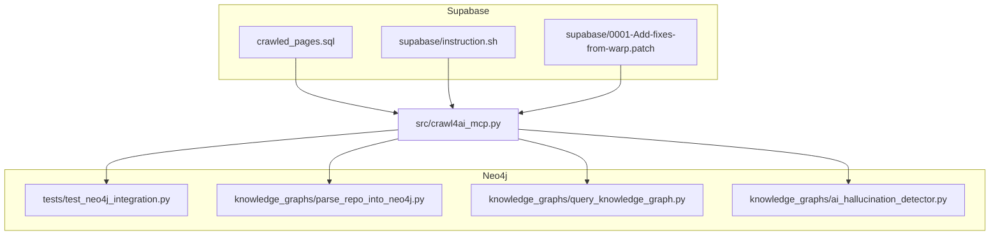
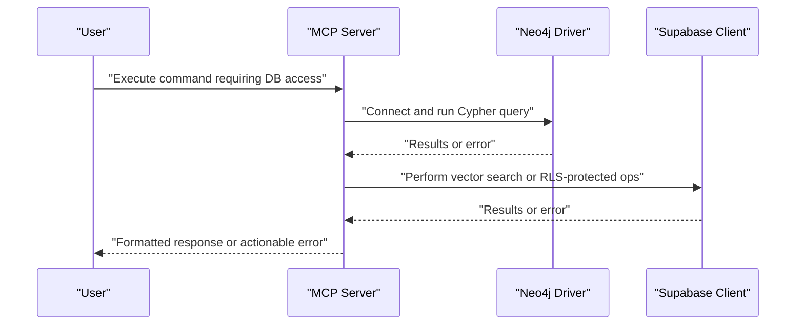
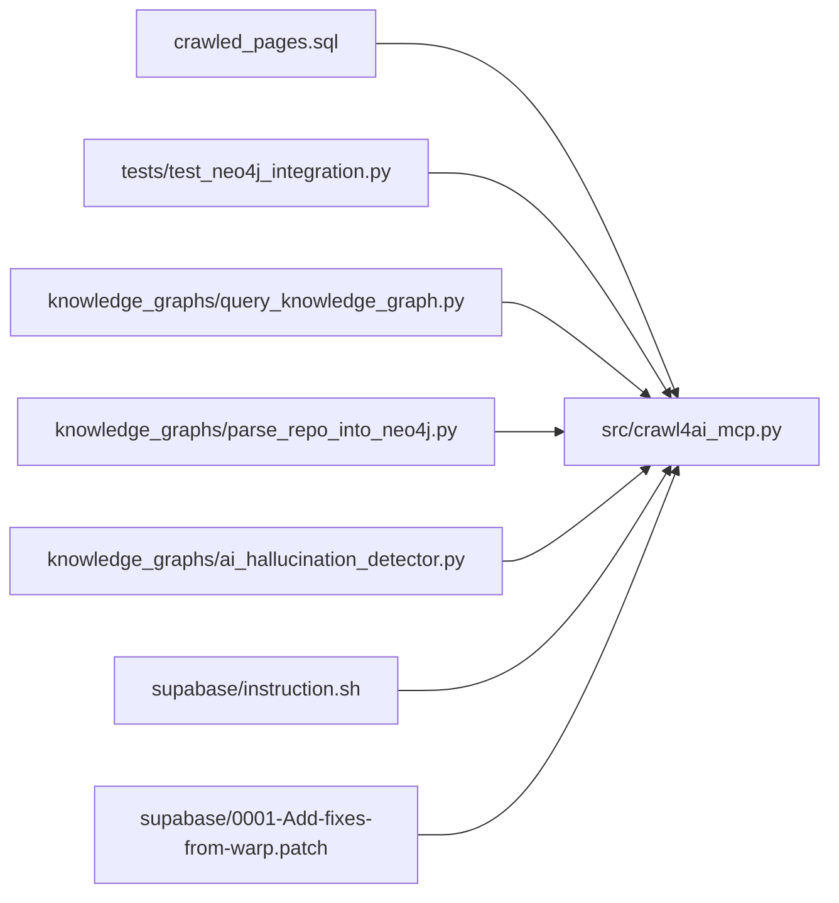

# Database Connectivity Problems

<cite>
**Referenced Files in This Document**
- [README.md](file://README.md)
- [supabase/instruction.sh](file://supabase/instruction.sh)
- [supabase/0001-Add-fixes-from-warp.patch](file://supabase/0001-Add-fixes-from-warp.patch)
- [crawled_pages.sql](file://crawled_pages.sql)
- [tests/test_neo4j_integration.py](file://tests/test_neo4j_integration.py)
- [knowledge_graphs/parse_repo_into_neo4j.py](file://knowledge_graphs/parse_repo_into_neo4j.py)
- [knowledge_graphs/query_knowledge_graph.py](file://knowledge_graphs/query_knowledge_graph.py)
- [knowledge_graphs/ai_hallucination_detector.py](file://knowledge_graphs/ai_hallucination_detector.py)
- [src/crawl4ai_mcp.py](file://src/crawl4ai_mcp.py)
</cite>

## Table of Contents
1. [Introduction](#introduction)
2. [Project Structure](#project-structure)
3. [Core Components](#core-components)
4. [Architecture Overview](#architecture-overview)
5. [Detailed Component Analysis](#detailed-component-analysis)
6. [Dependency Analysis](#dependency-analysis)
7. [Performance Considerations](#performance-considerations)
8. [Troubleshooting Guide](#troubleshooting-guide)
9. [Conclusion](#conclusion)

## Introduction
This document focuses on diagnosing and resolving database connectivity issues for Supabase and Neo4j within this project. It covers:
- Authentication failures and credential configuration
- Connection string correctness and environment setup
- Schema mismatches in the vectorized crawled pages schema
- Session pooling and connection pooler behavior
- Neo4j graph population verification and broken relationship diagnostics
- Database reachability checks, query performance inspection, and transaction failure recovery
- Practical validation steps using the provided scripts and integration tests

## Project Structure
The repository organizes database-related assets and tools as follows:
- Supabase setup and proxy fixes under the supabase directory
- PostgreSQL schema for vector storage under the project root
- Neo4j integration tests and tools under knowledge_graphs
- MCP server integration that surfaces Neo4j errors and handles Cypher queries

**Diagram sources**
- [supabase/instruction.sh](file://supabase/instruction.sh#L1-L28)
- [supabase/0001-Add-fixes-from-warp.patch](file://supabase/0001-Add-fixes-from-warp.patch#L1-L414)
- [crawled_pages.sql](file://crawled_pages.sql#L1-L175)
- [tests/test_neo4j_integration.py](file://tests/test_neo4j_integration.py#L1-L269)
- [knowledge_graphs/parse_repo_into_neo4j.py](file://knowledge_graphs/parse_repo_into_neo4j.py#L396-L595)
- [knowledge_graphs/query_knowledge_graph.py](file://knowledge_graphs/query_knowledge_graph.py#L1-L200)
- [knowledge_graphs/ai_hallucination_detector.py](file://knowledge_graphs/ai_hallucination_detector.py#L250-L335)
- [src/crawl4ai_mcp.py](file://src/crawl4ai_mcp.py#L73-L82)

**Section sources**
- [README.md](file://README.md#L150-L243)
- [supabase/instruction.sh](file://supabase/instruction.sh#L1-L28)
- [supabase/0001-Add-fixes-from-warp.patch](file://supabase/0001-Add-fixes-from-warp.patch#L1-L414)
- [crawled_pages.sql](file://crawled_pages.sql#L1-L175)
- [tests/test_neo4j_integration.py](file://tests/test_neo4j_integration.py#L1-L269)
- [knowledge_graphs/parse_repo_into_neo4j.py](file://knowledge_graphs/parse_repo_into_neo4j.py#L396-L595)
- [knowledge_graphs/query_knowledge_graph.py](file://knowledge_graphs/query_knowledge_graph.py#L1-L200)
- [knowledge_graphs/ai_hallucination_detector.py](file://knowledge_graphs/ai_hallucination_detector.py#L250-L335)
- [src/crawl4ai_mcp.py](file://src/crawl4ai_mcp.py#L73-L82)

## Core Components
- Supabase vector storage setup and schema: The schema defines vector indexes, RLS policies, and helper functions for similarity search. It expects a vector dimension aligned with the embedding provider used.
- Neo4j integration tests: Validates connection, imports, parsing availability, and query/write/delete operations.
- Neo4j tools: Asynchronous drivers for parsing repositories and querying the graph.
- MCP server error handling: Provides actionable messages for Neo4j authentication/connection/database errors.

Key responsibilities:
- Supabase: Provide vectorized similarity search and RLS-enabled tables for embeddings.
- Neo4j: Store and query the knowledge graph with constraints and indexes for performance.
- MCP: Surface database errors to users and execute Cypher queries safely.

**Section sources**
- [crawled_pages.sql](file://crawled_pages.sql#L1-L175)
- [tests/test_neo4j_integration.py](file://tests/test_neo4j_integration.py#L35-L177)
- [knowledge_graphs/parse_repo_into_neo4j.py](file://knowledge_graphs/parse_repo_into_neo4j.py#L396-L436)
- [knowledge_graphs/query_knowledge_graph.py](file://knowledge_graphs/query_knowledge_graph.py#L1-L60)
- [src/crawl4ai_mcp.py](file://src/crawl4ai_mcp.py#L73-L82)

## Architecture Overview
The system integrates Supabase for vector storage and Neo4j for knowledge graph operations. The MCP server orchestrates database interactions and surfaces errors to users.

**Diagram sources**
- [src/crawl4ai_mcp.py](file://src/crawl4ai_mcp.py#L2019-L2051)
- [knowledge_graphs/query_knowledge_graph.py](file://knowledge_graphs/query_knowledge_graph.py#L1-L60)
- [crawled_pages.sql](file://crawled_pages.sql#L46-L80)

## Detailed Component Analysis

### Supabase Vector Storage Setup
- Purpose: Enable vector similarity search and secure access via RLS.
- Key elements:
  - Extension and tables for sources and crawled pages
  - Vector column with dimension matching the embedding provider
  - IVFFlat index with cosine operator for similarity
  - GIN index on metadata and source_id for filtering
  - Helper function for similarity search with filters and source scoping
  - RLS policies enabling public read access

Common issues:
- Incorrect embedding dimension mismatch between stored embeddings and search embeddings
- Missing pgvector extension or index creation
- RLS policies preventing reads/writes

Validation steps:
- Confirm pgvector extension is installed and schema ran successfully
- Verify index existence and RLS policies
- Ensure embedding dimension aligns with the selected provider

**Section sources**
- [crawled_pages.sql](file://crawled_pages.sql#L1-L175)
- [README.md](file://README.md#L150-L160)

### Neo4j Knowledge Graph Integration
- Connection and environment:
  - Defaults for URI, user, and password are defined in tools and tests
  - Environment variables are loaded from .env for integration tests
- Tools:
  - DirectNeo4jExtractor initializes driver, creates constraints/indexes, and parses repositories
  - KnowledgeGraphQuerier connects asynchronously and lists/queries graph contents
  - AI Hallucination Detector validates credentials and runs detection

Common issues:
- Authentication failures due to missing or incorrect password
- Connection refused when Neo4j is unreachable or not running
- Broken relationships or missing nodes after parsing

Validation steps:
- Run integration tests to validate connection, imports, and query/write operations
- Use the query tool to list repositories and explore graph structure
- Parse a small repository and verify nodes/relationships

**Section sources**
- [tests/test_neo4j_integration.py](file://tests/test_neo4j_integration.py#L35-L177)
- [knowledge_graphs/parse_repo_into_neo4j.py](file://knowledge_graphs/parse_repo_into_neo4j.py#L396-L436)
- [knowledge_graphs/query_knowledge_graph.py](file://knowledge_graphs/query_knowledge_graph.py#L1-L60)
- [knowledge_graphs/ai_hallucination_detector.py](file://knowledge_graphs/ai_hallucination_detector.py#L250-L335)

### MCP Server Error Handling
- The MCP server detects common Neo4j error categories and returns user-friendly messages:
  - Authentication failures
  - Connection/refused/timeouts
  - Database errors

This helps quickly diagnose whether the problem is with credentials, network, or database state.

**Section sources**
- [src/crawl4ai_mcp.py](file://src/crawl4ai_mcp.py#L73-L82)

## Dependency Analysis
- Supabase schema depends on pgvector and Postgres features; the helper function and indexes are critical for performance.
- Neo4j tools depend on environment variables and asynchronous drivers; tests validate the end-to-end flow.
- MCP server integrates both databases and surfaces errors to users.

**Diagram sources**
- [crawled_pages.sql](file://crawled_pages.sql#L1-L175)
- [tests/test_neo4j_integration.py](file://tests/test_neo4j_integration.py#L1-L269)
- [knowledge_graphs/query_knowledge_graph.py](file://knowledge_graphs/query_knowledge_graph.py#L1-L60)
- [knowledge_graphs/parse_repo_into_neo4j.py](file://knowledge_graphs/parse_repo_into_neo4j.py#L396-L436)
- [knowledge_graphs/ai_hallucination_detector.py](file://knowledge_graphs/ai_hallucination_detector.py#L250-L335)
- [src/crawl4ai_mcp.py](file://src/crawl4ai_mcp.py#L2019-L2051)
- [supabase/instruction.sh](file://supabase/instruction.sh#L1-L28)
- [supabase/0001-Add-fixes-from-warp.patch](file://supabase/0001-Add-fixes-from-warp.patch#L1-L414)

**Section sources**
- [crawled_pages.sql](file://crawled_pages.sql#L1-L175)
- [tests/test_neo4j_integration.py](file://tests/test_neo4j_integration.py#L1-L269)
- [knowledge_graphs/query_knowledge_graph.py](file://knowledge_graphs/query_knowledge_graph.py#L1-L60)
- [knowledge_graphs/parse_repo_into_neo4j.py](file://knowledge_graphs/parse_repo_into_neo4j.py#L396-L436)
- [knowledge_graphs/ai_hallucination_detector.py](file://knowledge_graphs/ai_hallucination_detector.py#L250-L335)
- [src/crawl4ai_mcp.py](file://src/crawl4ai_mcp.py#L73-L82)

## Performance Considerations
- Supabase vector search performance relies on IVFFlat index with cosine operator and metadata/GIN indexes. Ensure these are created and maintained.
- Neo4j performance benefits from constraints and indexes established during initialization. Avoid excessive writes during parsing; batch operations where possible.
- Connection pooling:
  - Supabase Docker Compose patch demonstrates a connection pooler service and proxy configuration adjustments for health checks. This indicates the presence of a pooler and highlights proxy-related pitfalls.
  - Neo4j driver manages sessions; keep sessions short-lived and reuse drivers appropriately.

[No sources needed since this section provides general guidance]

## Troubleshooting Guide

### Supabase Vector Storage Setup
- Validate pgvector installation and schema execution:
  - Follow the Supabase SQL editor steps to run the schema.
  - Confirm the extension exists and tables were created.
- Check embedding dimension alignment:
  - Ensure the vector dimension matches the embedding provider used (e.g., 1536 for OpenAI/Copilot).
  - If mismatched, either re-embed with the correct dimension or adjust the schema accordingly.
- Inspect indexes and policies:
  - Verify IVFFlat index on the vector column and GIN index on metadata/source_id.
  - Confirm RLS policies allow read access as intended.

**Section sources**
- [README.md](file://README.md#L150-L160)
- [crawled_pages.sql](file://crawled_pages.sql#L1-L175)

### Supabase Connection Pooler and Proxy Issues
- The Supabase Docker Compose patch documents proxy-related health check failures and the fix for the pooler and vector services.
- Symptom: Containers marked as unhealthy due to proxy environment variables inherited from the host.
- Resolution:
  - Unset proxy variables in health checks or configure proper proxy URLs and NO_PROXY entries.
  - Restart affected containers and verify health status.

**Section sources**
- [supabase/0001-Add-fixes-from-warp.patch](file://supabase/0001-Add-fixes-from-warp.patch#L1-L414)

### Neo4j Graph Population and Broken Relationships
- Verify Neo4j is reachable and credentials are correct:
  - Use the integration test to validate connection and version.
  - Ensure NEO4J_URI, NEO4J_USER, and NEO4J_PASSWORD are set.
- Check graph contents:
  - Use the query tool to list repositories and explore classes/functions.
  - Look for missing nodes or dangling relationships after parsing.
- Diagnose broken relationships:
  - Run targeted Cypher queries to identify missing relationships or orphaned nodes.
  - Re-parse the repository to rebuild constraints and indexes.

**Section sources**
- [tests/test_neo4j_integration.py](file://tests/test_neo4j_integration.py#L35-L177)
- [knowledge_graphs/query_knowledge_graph.py](file://knowledge_graphs/query_knowledge_graph.py#L1-L120)
- [knowledge_graphs/parse_repo_into_neo4j.py](file://knowledge_graphs/parse_repo_into_neo4j.py#L437-L595)

### Authentication Failures
- Neo4j:
  - Ensure NEO4J_PASSWORD is set and not the default placeholder.
  - The hallucination detector enforces a non-default password requirement.
- Supabase:
  - Confirm SUPABASE_URL and SUPABASE_SERVICE_KEY are configured.
  - Validate that RLS policies and roles permit required operations.

**Section sources**
- [knowledge_graphs/ai_hallucination_detector.py](file://knowledge_graphs/ai_hallucination_detector.py#L290-L300)
- [README.md](file://README.md#L234-L242)

### Incorrect Connection Strings
- Neo4j:
  - Defaults are bolt://localhost:7687; verify the URI matches your deployment.
  - Integration tests and tools source URIs from environment variables.
- Supabase:
  - Use the Supabase project URL and service key as configured in the environment.

**Section sources**
- [tests/test_neo4j_integration.py](file://tests/test_neo4j_integration.py#L40-L50)
- [knowledge_graphs/parse_repo_into_neo4j.py](file://knowledge_graphs/parse_repo_into_neo4j.py#L817-L819)
- [knowledge_graphs/query_knowledge_graph.py](file://knowledge_graphs/query_knowledge_graph.py#L363-L365)
- [README.md](file://README.md#L234-L242)

### Schema Mismatches in Crawled Pages
- Symptom: Vector similarity search fails due to dimension mismatch.
- Action:
  - Align embedding dimension with the stored schema (e.g., 1536).
  - Recreate embeddings consistently or adjust schema to match actual stored dimensions.

**Section sources**
- [crawled_pages.sql](file://crawled_pages.sql#L20-L35)

### Write/Read Timeouts and Transaction Failures
- Neo4j:
  - Keep sessions short and avoid long-running transactions.
  - Use the query tool’s session-based operations and close connections promptly.
  - For MCP commands, results are limited to prevent overwhelming responses.
- Recover:
  - Retry failed operations with backoff.
  - Inspect logs and re-run targeted queries to isolate problematic nodes/relationships.

**Section sources**
- [knowledge_graphs/query_knowledge_graph.py](file://knowledge_graphs/query_knowledge_graph.py#L265-L282)
- [src/crawl4ai_mcp.py](file://src/crawl4ai_mcp.py#L2019-L2051)

### Database Reachability Checks
- Neo4j:
  - Run the integration test to validate connection and version.
  - Attempt a simple RETURN statement and list repositories.
- Supabase:
  - Use the Supabase SQL editor to run schema and helper function tests.
  - Confirm the vector index and RLS policies are active.

**Section sources**
- [tests/test_neo4j_integration.py](file://tests/test_neo4j_integration.py#L35-L177)
- [README.md](file://README.md#L150-L160)

### Inspecting Query Performance
- Neo4j:
  - Use the query tool to explore counts and listings; add LIMIT clauses to manage result size.
  - Review constraints and indexes created during initialization.
- Supabase:
  - Ensure indexes exist for metadata and source_id filtering.
  - Confirm IVFFlat index and cosine operator are effective.

**Section sources**
- [knowledge_graphs/query_knowledge_graph.py](file://knowledge_graphs/query_knowledge_graph.py#L1-L120)
- [crawled_pages.sql](file://crawled_pages.sql#L36-L45)

### Recovering from Transaction Failures
- Neo4j:
  - Keep transactions short and commit early.
  - Re-parse repositories to rebuild constraints and indexes if corrupted.
- Supabase:
  - Re-run schema to recreate indexes and policies if needed.

**Section sources**
- [knowledge_graphs/parse_repo_into_neo4j.py](file://knowledge_graphs/parse_repo_into_neo4j.py#L437-L595)
- [crawled_pages.sql](file://crawled_pages.sql#L81-L100)

## Conclusion
This guide consolidates practical steps to resolve Supabase and Neo4j connectivity issues in this project. By validating schema and indexes, confirming environment variables and credentials, and leveraging the provided integration tests and tools, most problems can be diagnosed and resolved efficiently. For Supabase, pay special attention to embedding dimensions and proxy-related pooler health checks. For Neo4j, ensure constraints/indexes are intact and use the query tools to verify graph integrity and diagnose broken relationships.