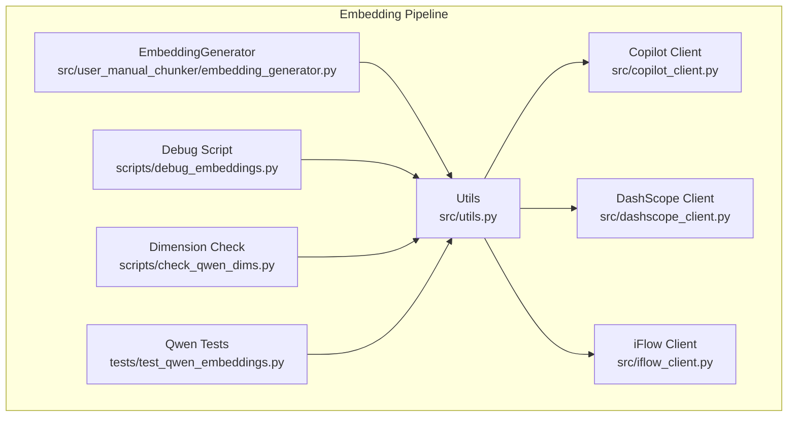
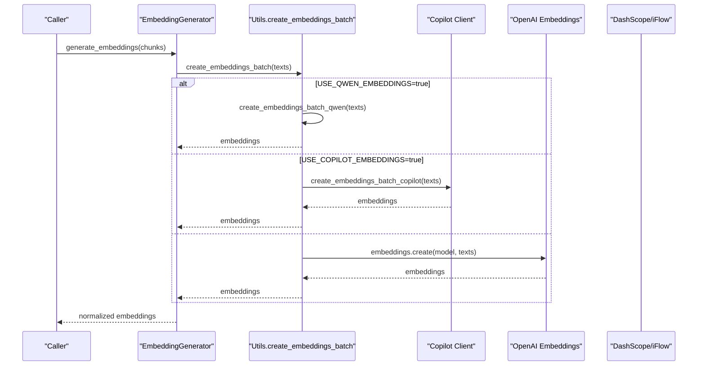
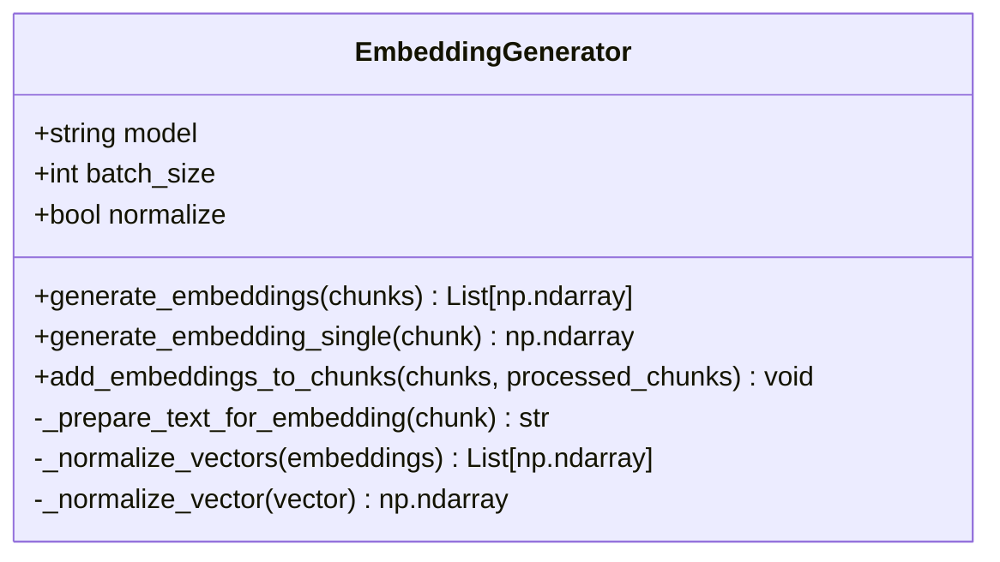
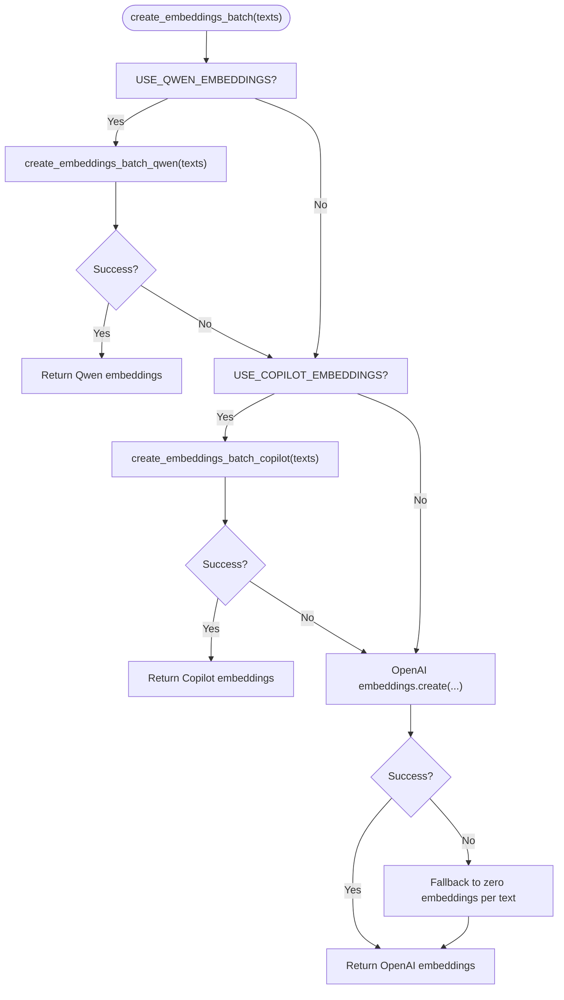
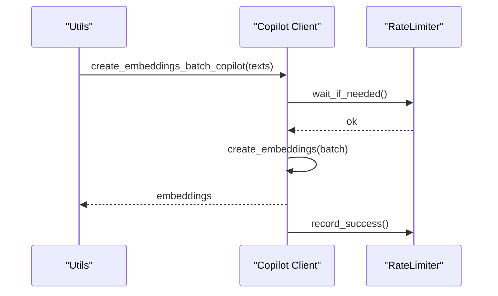
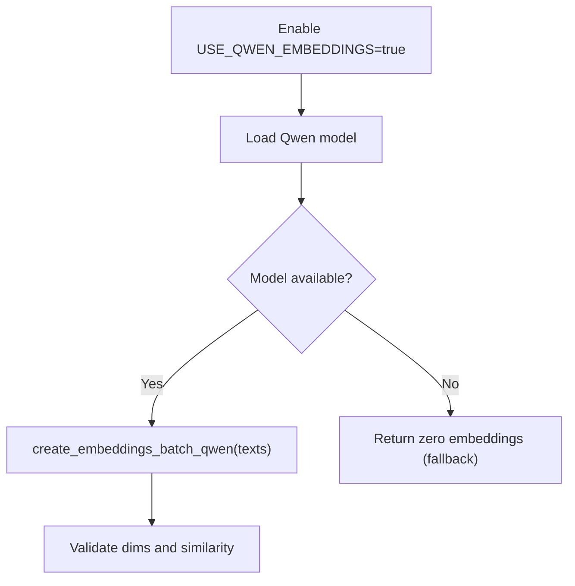
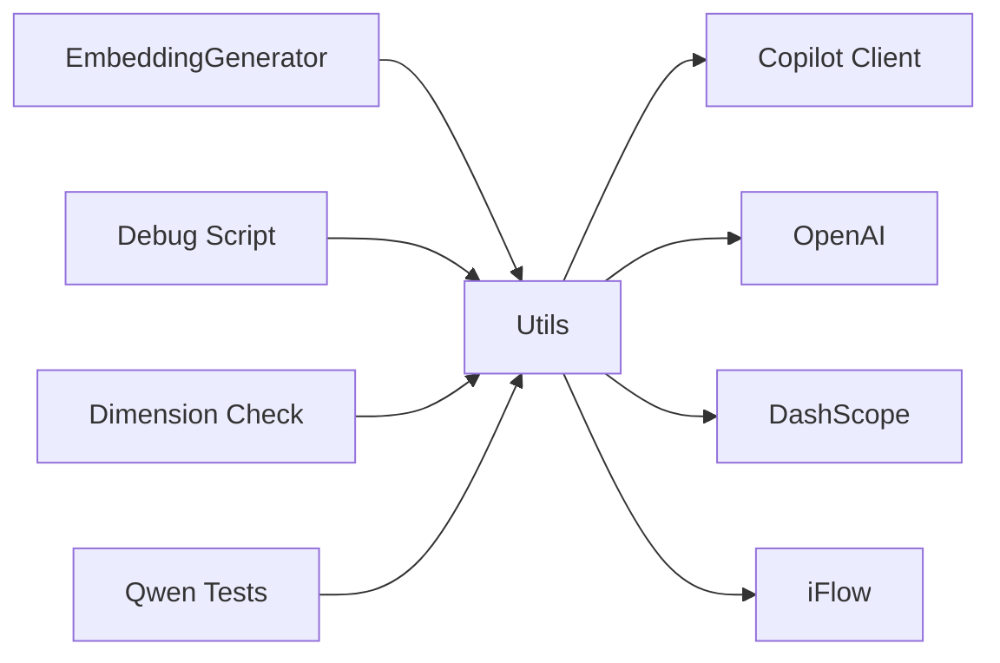
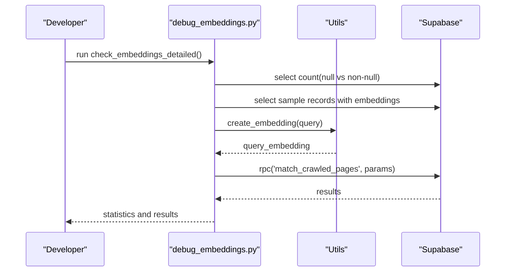

# Embedding Generation Issues

<cite>
**Referenced Files in This Document**
- [EMBEDDING_GENERATOR_IMPLEMENTATION.md](file://EMBEDDING_GENERATOR_IMPLEMENTATION.md)
- [scripts/debug_embeddings.py](file://scripts/debug_embeddings.py)
- [scripts/check_qwen_dims.py](file://scripts/check_qwen_dims.py)
- [tests/test_qwen_embeddings.py](file://tests/test_qwen_embeddings.py)
- [src/utils.py](file://src/utils.py)
- [src/copilot_client.py](file://src/copilot_client.py)
- [src/dashscope_client.py](file://src/dashscope_client.py)
- [src/iflow_client.py](file://src/iflow_client.py)
- [src/user_manual_chunker/embedding_generator.py](file://src/user_manual_chunker/embedding_generator.py)
- [src/user_manual_chunker/interfaces.py](file://src/user_manual_chunker/interfaces.py)
- [src/user_manual_chunker/data_models.py](file://src/user_manual_chunker/data_models.py)
- [demo_embedding_generator.py](file://demo_embedding_generator.py)
- [README.md](file://README.md)
</cite>

## Table of Contents
1. [Introduction](#introduction)
2. [Project Structure](#project-structure)
3. [Core Components](#core-components)
4. [Architecture Overview](#architecture-overview)
5. [Detailed Component Analysis](#detailed-component-analysis)
6. [Dependency Analysis](#dependency-analysis)
7. [Performance Considerations](#performance-considerations)
8. [Troubleshooting Guide](#troubleshooting-guide)
9. [Conclusion](#conclusion)
10. [Appendices](#appendices)

## Introduction
This document provides a comprehensive troubleshooting guide for embedding generation problems in the repository. It covers:
- Slow embedding processing
- Incorrect chunking affecting semantic quality
- Provider-specific failures (OpenAI, GitHub Copilot, local Qwen)
- How to use debug_embeddings.py to isolate and inspect embedding outputs
- Configuration mismatches in embedding dimensions and model compatibility
- Solutions for out-of-memory errors during batch processing
- Validating embedding integrity through similarity tests
- References to test_qwen_embeddings.py for validation workflows and EMBEDDING_GENERATOR_IMPLEMENTATION.md for architectural context

## Project Structure
The embedding pipeline spans multiple modules:
- Embedding generator for user-manual chunking
- Utility functions orchestrating embedding providers
- GitHub Copilot client with rate limiting and fallbacks
- DashScope and iFlow clients for alternative providers
- Debugging and validation scripts
- Tests for Qwen embeddings

**Diagram sources**
- [src/user_manual_chunker/embedding_generator.py](file://src/user_manual_chunker/embedding_generator.py#L1-L213)
- [src/utils.py](file://src/utils.py#L1-L200)
- [src/copilot_client.py](file://src/copilot_client.py#L1-L120)
- [src/dashscope_client.py](file://src/dashscope_client.py#L1-L60)
- [src/iflow_client.py](file://src/iflow_client.py#L1-L60)
- [scripts/debug_embeddings.py](file://scripts/debug_embeddings.py#L1-L60)
- [scripts/check_qwen_dims.py](file://scripts/check_qwen_dims.py#L1-L40)
- [tests/test_qwen_embeddings.py](file://tests/test_qwen_embeddings.py#L1-L60)

**Section sources**
- [src/user_manual_chunker/embedding_generator.py](file://src/user_manual_chunker/embedding_generator.py#L1-L213)
- [src/utils.py](file://src/utils.py#L120-L200)
- [src/copilot_client.py](file://src/copilot_client.py#L180-L260)
- [src/dashscope_client.py](file://src/dashscope_client.py#L1-L60)
- [src/iflow_client.py](file://src/iflow_client.py#L1-L60)
- [scripts/debug_embeddings.py](file://scripts/debug_embeddings.py#L1-L60)
- [scripts/check_qwen_dims.py](file://scripts/check_qwen_dims.py#L1-L40)
- [tests/test_qwen_embeddings.py](file://tests/test_qwen_embeddings.py#L1-L60)

## Core Components
- EmbeddingGenerator: Batch and single embedding generation with normalization and code syntax preservation.
- Utils: Centralized embedding orchestration with provider selection and fallbacks.
- Copilot Client: Async client with rate limiting, token refresh, and batch/single embedding methods.
- DashScope/iFlow Clients: Alternative providers for chat and potential embedding pathways.
- Debug and Validation Scripts: Tools to inspect stored embeddings and validate Qwen dimensions.

**Section sources**
- [src/user_manual_chunker/embedding_generator.py](file://src/user_manual_chunker/embedding_generator.py#L21-L120)
- [src/utils.py](file://src/utils.py#L120-L200)
- [src/copilot_client.py](file://src/copilot_client.py#L180-L260)
- [src/dashscope_client.py](file://src/dashscope_client.py#L1-L60)
- [src/iflow_client.py](file://src/iflow_client.py#L1-L60)
- [scripts/debug_embeddings.py](file://scripts/debug_embeddings.py#L1-L60)
- [scripts/check_qwen_dims.py](file://scripts/check_qwen_dims.py#L1-L40)
- [tests/test_qwen_embeddings.py](file://tests/test_qwen_embeddings.py#L1-L60)

## Architecture Overview
The embedding generation architecture integrates multiple providers with deterministic fallbacks and robust error handling.

**Diagram sources**
- [src/user_manual_chunker/embedding_generator.py](file://src/user_manual_chunker/embedding_generator.py#L48-L120)
- [src/utils.py](file://src/utils.py#L120-L200)
- [src/copilot_client.py](file://src/copilot_client.py#L262-L313)
- [src/dashscope_client.py](file://src/dashscope_client.py#L1-L60)
- [src/iflow_client.py](file://src/iflow_client.py#L1-L60)

## Detailed Component Analysis

### EmbeddingGenerator Analysis
- Batch processing with configurable batch size and automatic batching.
- Normalization for cosine similarity.
- Code syntax preservation in embedding input.
- Error handling with descriptive messages and batch identification.

**Diagram sources**
- [src/user_manual_chunker/embedding_generator.py](file://src/user_manual_chunker/embedding_generator.py#L21-L213)

**Section sources**
- [src/user_manual_chunker/embedding_generator.py](file://src/user_manual_chunker/embedding_generator.py#L21-L213)
- [EMBEDDING_GENERATOR_IMPLEMENTATION.md](file://EMBEDDING_GENERATOR_IMPLEMENTATION.md#L20-L120)

### Utils Embedding Orchestration
- Provider selection order: Qwen -> Copilot -> OpenAI.
- Fallback behavior for provider failures.
- Dimension consistency and fallback to zero embeddings when needed.

**Diagram sources**
- [src/utils.py](file://src/utils.py#L120-L200)
- [src/copilot_client.py](file://src/copilot_client.py#L262-L313)

**Section sources**
- [src/utils.py](file://src/utils.py#L120-L200)

### Copilot Client and Rate Limiting
- Async client with rate limiter and exponential backoff.
- Token refresh on 401 errors.
- Batch and single embedding methods with fallbacks.

**Diagram sources**
- [src/copilot_client.py](file://src/copilot_client.py#L180-L260)
- [src/copilot_client.py](file://src/copilot_client.py#L1-L120)

**Section sources**
- [src/copilot_client.py](file://src/copilot_client.py#L1-L120)
- [src/copilot_client.py](file://src/copilot_client.py#L180-L260)

### Qwen Embedding Validation
- Tests cover model availability, single/batch embeddings, dimension consistency, similarity behavior, fallbacks, and error handling.
- Validation workflow references for Qwen embeddings.

**Diagram sources**
- [tests/test_qwen_embeddings.py](file://tests/test_qwen_embeddings.py#L1-L120)
- [src/utils.py](file://src/utils.py#L66-L105)

**Section sources**
- [tests/test_qwen_embeddings.py](file://tests/test_qwen_embeddings.py#L1-L120)
- [src/utils.py](file://src/utils.py#L66-L105)

### Dimension Mismatch and Compatibility
- scripts/check_qwen_dims.py highlights dimension mismatches between Qwen (e.g., 19309) and Copilot/OpenAI (1536).
- Guidance to align configuration or reindex embeddings.

**Section sources**
- [scripts/check_qwen_dims.py](file://scripts/check_qwen_dims.py#L1-L89)
- [README.md](file://README.md#L244-L266)

## Dependency Analysis
- EmbeddingGenerator depends on Copilot client for batch/single embeddings and on utils for provider orchestration.
- Utils depends on Copilot, OpenAI, DashScope, and iFlow clients.
- Debug and validation scripts depend on utils and Supabase client.

**Diagram sources**
- [src/user_manual_chunker/embedding_generator.py](file://src/user_manual_chunker/embedding_generator.py#L1-L40)
- [src/utils.py](file://src/utils.py#L1-L60)
- [src/copilot_client.py](file://src/copilot_client.py#L1-L60)
- [src/dashscope_client.py](file://src/dashscope_client.py#L1-L40)
- [src/iflow_client.py](file://src/iflow_client.py#L1-L40)
- [scripts/debug_embeddings.py](file://scripts/debug_embeddings.py#L1-L40)
- [scripts/check_qwen_dims.py](file://scripts/check_qwen_dims.py#L1-L40)
- [tests/test_qwen_embeddings.py](file://tests/test_qwen_embeddings.py#L1-L40)

**Section sources**
- [src/user_manual_chunker/embedding_generator.py](file://src/user_manual_chunker/embedding_generator.py#L1-L40)
- [src/utils.py](file://src/utils.py#L1-L60)
- [src/copilot_client.py](file://src/copilot_client.py#L1-L60)
- [src/dashscope_client.py](file://src/dashscope_client.py#L1-L40)
- [src/iflow_client.py](file://src/iflow_client.py#L1-L40)
- [scripts/debug_embeddings.py](file://scripts/debug_embeddings.py#L1-L40)
- [scripts/check_qwen_dims.py](file://scripts/check_qwen_dims.py#L1-L40)
- [tests/test_qwen_embeddings.py](file://tests/test_qwen_embeddings.py#L1-L40)

## Performance Considerations
- Batch-first design reduces API overhead; default batch size is tuned for efficiency.
- Vector normalization impact is negligible due to vectorized numpy operations.
- Memory usage scales linearly with the number of embeddings; each embedding for the default model is approximately 6KB (float32).
- Rate limiting and retries mitigate provider latency and transient failures.

**Section sources**
- [EMBEDDING_GENERATOR_IMPLEMENTATION.md](file://EMBEDDING_GENERATOR_IMPLEMENTATION.md#L166-L206)
- [src/copilot_client.py](file://src/copilot_client.py#L1-L120)

## Troubleshooting Guide

### Slow Embedding Processing
- Verify provider configuration and rate limits:
  - For Copilot, adjust COPILOT_REQUESTS_PER_MINUTE and ensure GITHUB_TOKEN is set.
  - For OpenAI, confirm OPENAI_API_KEY and consider enabling USE_COPILOT_EMBEDDINGS to leverage Copilot’s free tier.
- Increase batch size cautiously; larger batches reduce per-request overhead but increase memory usage.
- Use normalization only when needed; it adds minimal overhead but is essential for cosine similarity.

**Section sources**
- [README.md](file://README.md#L288-L317)
- [src/utils.py](file://src/utils.py#L120-L200)
- [EMBEDDING_GENERATOR_IMPLEMENTATION.md](file://EMBEDDING_GENERATOR_IMPLEMENTATION.md#L166-L206)

### Incorrect Chunking Affecting Semantic Quality
- Ensure chunk boundaries respect semantic boundaries and code syntax preservation.
- EmbeddingGenerator preserves code blocks; verify that chunk content retains triple-backtick markers and language identifiers.
- Use contextual embeddings (via MODEL_CHOICE) when precision is critical.

**Section sources**
- [src/user_manual_chunker/embedding_generator.py](file://src/user_manual_chunker/embedding_generator.py#L128-L145)
- [README.md](file://README.md#L320-L340)

### Provider-Specific Failures
- GitHub Copilot:
  - Missing GITHUB_TOKEN causes initialization failures; ensure token is set and valid.
  - Rate limiting and 429/5xx errors trigger exponential backoff; adjust COPILOT_REQUESTS_PER_MINUTE.
  - Token refresh on 401; if persistent, verify subscription status.
- OpenAI:
  - Missing OPENAI_API_KEY leads to failures; ensure key is configured.
  - Fallback to individual embedding creation with zero-fallback on error.
- Local Qwen:
  - sentence-transformers must be installed; otherwise, fallback to zero embeddings.
  - Model loading failures are handled gracefully with lazy loading and fallback.

**Section sources**
- [src/copilot_client.py](file://src/copilot_client.py#L111-L160)
- [src/copilot_client.py](file://src/copilot_client.py#L213-L260)
- [src/utils.py](file://src/utils.py#L120-L200)
- [tests/test_qwen_embeddings.py](file://tests/test_qwen_embeddings.py#L1-L120)

### Using debug_embeddings.py to Inspect Embeddings
- The script checks counts of records with null vs non-null embeddings, samples embeddings, and validates function availability.
- It demonstrates direct search with match_crawled_pages RPC and verifies query embeddings.

**Diagram sources**
- [scripts/debug_embeddings.py](file://scripts/debug_embeddings.py#L1-L100)
- [src/utils.py](file://src/utils.py#L549-L587)

**Section sources**
- [scripts/debug_embeddings.py](file://scripts/debug_embeddings.py#L1-L100)
- [src/utils.py](file://src/utils.py#L549-L587)

### Configuration Mismatches and Model Compatibility
- Dimension mismatch:
  - If database contains 19309-dimensional embeddings but search uses 1536, similarity search will fail.
  - Align configuration by enabling USE_QWEN_EMBEDDINGS or reindexing with consistent dimensions.
- Model compatibility:
  - Copilot/OpenAI use text-embedding-3-small (1536).
  - Qwen model may produce different dimensions; validate with scripts/check_qwen_dims.py.

**Section sources**
- [scripts/check_qwen_dims.py](file://scripts/check_qwen_dims.py#L1-L89)
- [README.md](file://README.md#L244-L266)

### Out-of-Memory Errors During Batch Processing
- Reduce batch size to fit memory constraints.
- Process in smaller chunks and stream results to disk or database.
- Avoid storing all embeddings in memory simultaneously; write to Supabase in batches.
- For large document sets, consider disabling contextual embeddings to reduce compute.

**Section sources**
- [src/utils.py](file://src/utils.py#L383-L548)
- [README.md](file://README.md#L320-L340)

### Validating Embedding Integrity Through Similarity Tests
- Use tests/test_qwen_embeddings.py to validate:
  - Model loading and fallback behavior
  - Dimension consistency across embeddings
  - Cosine similarity between similar vs dissimilar texts
  - Error handling and zero-embedding fallbacks
- For Copilot/OpenAI, validate that embeddings are normalized and dimension-consistent.

**Section sources**
- [tests/test_qwen_embeddings.py](file://tests/test_qwen_embeddings.py#L1-L194)
- [src/user_manual_chunker/embedding_generator.py](file://src/user_manual_chunker/embedding_generator.py#L146-L181)

### Additional Validation Workflows
- demo_embedding_generator.py demonstrates:
  - Parsing, chunking, and embedding generation
  - Code syntax preservation
  - Normalization verification
  - Batch processing efficiency

**Section sources**
- [demo_embedding_generator.py](file://demo_embedding_generator.py#L1-L190)

## Conclusion
This guide consolidates actionable steps to diagnose and resolve embedding generation issues across providers, configurations, and runtime conditions. By leveraging the provided scripts, tests, and architectural insights, teams can stabilize embedding pipelines, validate model compatibility, and maintain high-quality semantic retrieval.

## Appendices

### Provider Configuration Checklist
- Copilot:
  - GITHUB_TOKEN set
  - COPILOT_REQUESTS_PER_MINUTE appropriate
- OpenAI:
  - OPENAI_API_KEY set
- Qwen:
  - sentence-transformers installed
  - USE_QWEN_EMBEDDINGS=true
- Dimension alignment:
  - scripts/check_qwen_dims.py to validate and align

**Section sources**
- [README.md](file://README.md#L206-L266)
- [scripts/check_qwen_dims.py](file://scripts/check_qwen_dims.py#L1-L89)