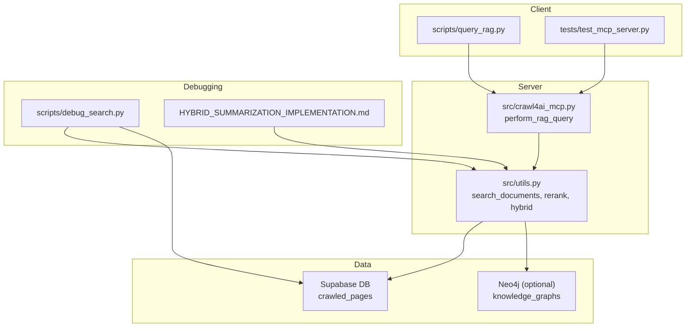
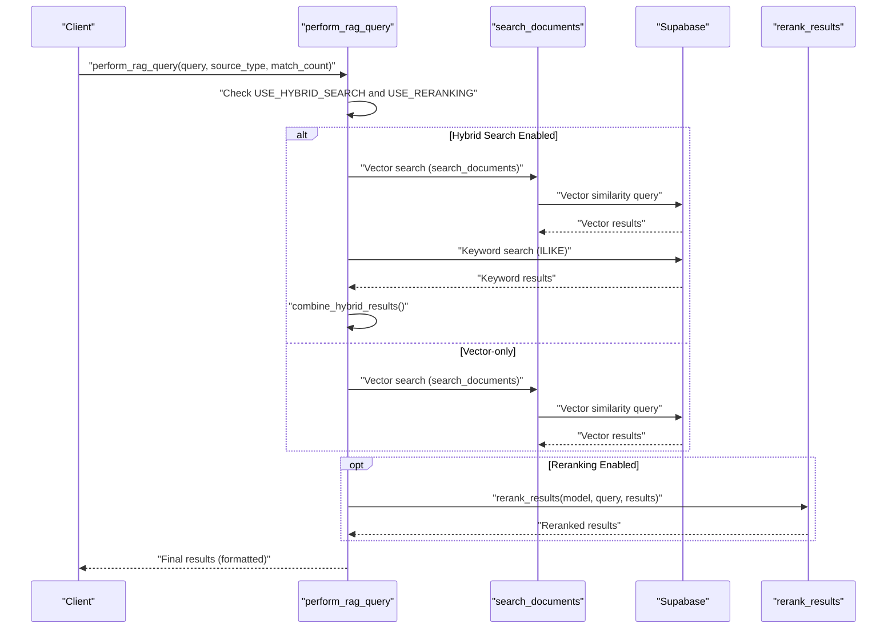
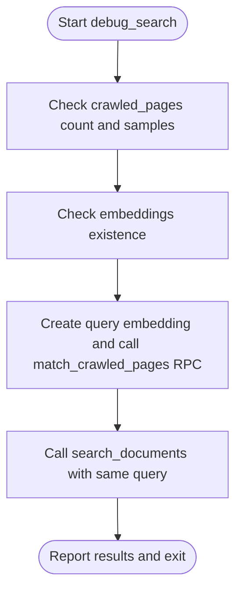
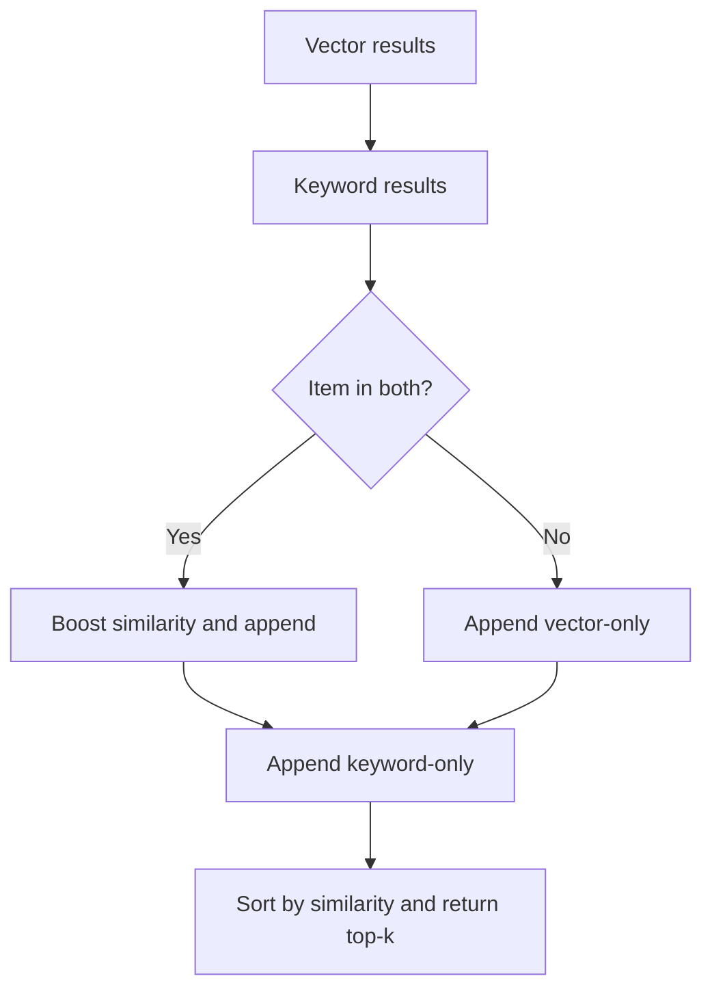
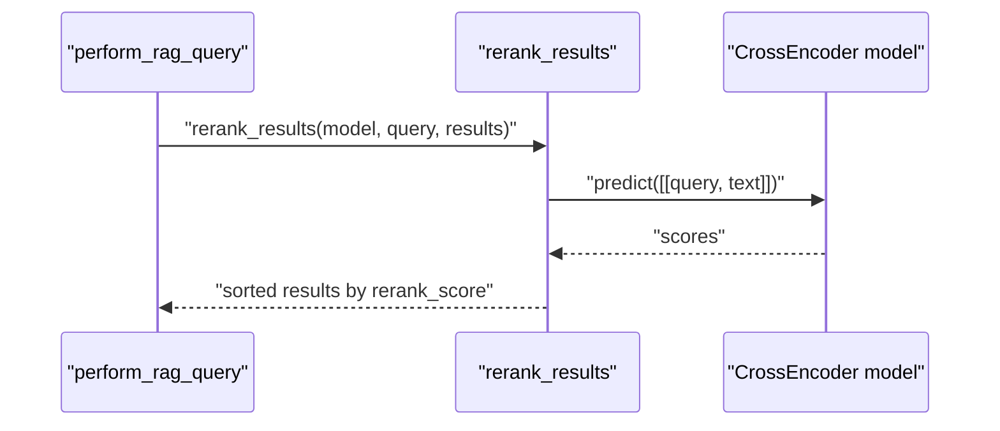
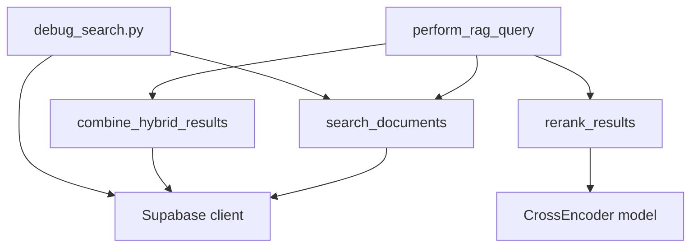

# Query Performance Bottlenecks

<cite>
**Referenced Files in This Document**
- [scripts/debug_search.py](file://scripts/debug_search.py)
- [src/crawl4ai_mcp.py](file://src/crawl4ai_mcp.py)
- [src/utils.py](file://src/utils.py)
- [tests/test_mcp_server.py](file://tests/test_mcp_server.py)
- [scripts/query_rag.py](file://scripts/query_rag.py)
- [HYBRID_SUMMARIZATION_IMPLEMENTATION.md](file://HYBRID_SUMMARIZATION_IMPLEMENTATION.md)
- [ANALYSIS_SUMMARIZATION_STRATEGY.md](file://ANALYSIS_SUMMARIZATION_STRATEGY.md)
- [README.md](file://README.md)
- [knowledge_graphs/parse_simics_into_neo4j.py](file://knowledge_graphs/parse_simics_into_neo4j.py)
</cite>

## Table of Contents
1. [Introduction](#introduction)
2. [Project Structure](#project-structure)
3. [Core Components](#core-components)
4. [Architecture Overview](#architecture-overview)
5. [Detailed Component Analysis](#detailed-component-analysis)
6. [Dependency Analysis](#dependency-analysis)
7. [Performance Considerations](#performance-considerations)
8. [Troubleshooting Guide](#troubleshooting-guide)
9. [Conclusion](#conclusion)
10. [Appendices](#appendices)

## Introduction
This document focuses on identifying and mitigating query performance bottlenecks in Retrieval-Augmented Generation (RAG) operations. It covers observable symptoms such as high latency in perform_rag_query, low relevance in search results, and excessive response times during hybrid search. It also explains how to use debug_search.py to analyze retrieval stages (keyword matching, semantic search, and reranking), and how to address inefficiencies in chunk retrieval, index utilization, and agentic RAG overhead. Practical optimization strategies are provided, including adjusting chunk size, tuning similarity thresholds, and enabling caching. References to HYBRID_SUMMARIZATION_IMPLEMENTATION.md and tests/test_mcp_server.py are included for advanced search logic and benchmarking query execution.

## Project Structure
The RAG system centers around:
- A server-side toolchain that exposes perform_rag_query and orchestrates hybrid search, reranking, and multi-source retrieval.
- Utilities for embedding creation, Supabase client management, and hybrid result combination.
- Debugging and testing scripts to validate configurations and diagnose performance issues.
- Summarization enhancements that improve retrieval quality and reduce reliance on keyword-only matches.

**Diagram sources**
- [scripts/query_rag.py](file://scripts/query_rag.py#L1-L120)
- [tests/test_mcp_server.py](file://tests/test_mcp_server.py#L151-L197)
- [src/crawl4ai_mcp.py](file://src/crawl4ai_mcp.py#L1150-L1334)
- [src/utils.py](file://src/utils.py#L1080-L1187)
- [scripts/debug_search.py](file://scripts/debug_search.py#L1-L95)
- [HYBRID_SUMMARIZATION_IMPLEMENTATION.md](file://HYBRID_SUMMARIZATION_IMPLEMENTATION.md#L343-L411)

**Section sources**
- [scripts/query_rag.py](file://scripts/query_rag.py#L1-L120)
- [tests/test_mcp_server.py](file://tests/test_mcp_server.py#L151-L197)
- [src/crawl4ai_mcp.py](file://src/crawl4ai_mcp.py#L1150-L1334)
- [src/utils.py](file://src/utils.py#L1080-L1187)
- [scripts/debug_search.py](file://scripts/debug_search.py#L1-L95)
- [HYBRID_SUMMARIZATION_IMPLEMENTATION.md](file://HYBRID_SUMMARIZATION_IMPLEMENTATION.md#L343-L411)

## Core Components
- perform_rag_query: Orchestrates hybrid search, reranking, and result formatting. It reads environment flags for hybrid search and reranking, executes vector and keyword retrieval, and applies reranking when configured.
- search_documents: Executes vector similarity search against Supabase and returns results with similarity scores.
- combine_hybrid_results: Merges vector and keyword results, prioritizing items present in both, and sorts by similarity.
- rerank_results: Applies cross-encoder reranking to improve result ordering.
- debug_search.py: Validates database state, checks embeddings, and exercises direct RPC calls to isolate vector search issues.
- query_rag.py: Command-line script to test RAG queries, including hybrid search and multi-source filtering.
- test_mcp_server.py: Validates server configuration, RAG feature flags, and tool availability.

**Section sources**
- [src/crawl4ai_mcp.py](file://src/crawl4ai_mcp.py#L1150-L1334)
- [src/utils.py](file://src/utils.py#L1080-L1187)
- [scripts/debug_search.py](file://scripts/debug_search.py#L1-L95)
- [scripts/query_rag.py](file://scripts/query_rag.py#L1-L120)
- [tests/test_mcp_server.py](file://tests/test_mcp_server.py#L151-L197)

## Architecture Overview
The RAG query pipeline integrates vector search, keyword matching, and reranking. Hybrid search combines both modalities to improve precision and recall. Reranking further refines the order of results. The server exposes perform_rag_query, which delegates to utilities for search and combination.

**Diagram sources**
- [src/crawl4ai_mcp.py](file://src/crawl4ai_mcp.py#L1240-L1334)
- [src/utils.py](file://src/utils.py#L1080-L1187)

## Detailed Component Analysis

### Symptom: High Latency in perform_rag_query
Common causes:
- Hybrid search doubles the number of database queries (vector + keyword).
- Reranking adds cross-encoder scoring for each result.
- Agentic RAG overhead increases crawling and indexing costs.
- Poor chunking leads to oversized chunks, increasing embedding and retrieval costs.
- Missing or misconfigured reranker model delays or disables reranking.

Mitigations:
- Enable USE_HYBRID_SEARCH judiciously; disable for simple queries.
- Enable USE_RERANKING only when precision is critical; monitor reranking latency.
- Optimize chunk size to balance semantic coherence and retrieval speed.
- Ensure reranker model loads successfully; pre-download models if needed.

**Section sources**
- [src/crawl4ai_mcp.py](file://src/crawl4ai_mcp.py#L1150-L1334)
- [src/utils.py](file://src/utils.py#L992-L1015)

### Symptom: Low Relevance in Search Results
Common causes:
- Pure vector search may miss semantically aligned results if embeddings lack domain-specific intent.
- Keyword-only matches often yield noisy results.
- Insufficient reranking reduces result ordering quality.

Mitigations:
- Enable USE_RERANKING to improve ranking order.
- Consider hybrid summarization to enhance embeddings with semantic summaries.
- Tune match_count and filter by source_type to reduce noise.

**Section sources**
- [README.md](file://README.md#L700-L773)
- [HYBRID_SUMMARIZATION_IMPLEMENTATION.md](file://HYBRID_SUMMARIZATION_IMPLEMENTATION.md#L343-L411)

### Symptom: Excessive Response Times During Hybrid Search
Common causes:
- Keyword search uses ILIKE on content, which can be slow without proper indexing.
- Combining results involves deduplication and sorting across both vectors and keywords.
- Multi-source queries multiply the number of searches.

Mitigations:
- Ensure database-level filters (source_id) are applied to limit result sets.
- Use index utilization for frequent filters and metadata keys.
- Reduce match_count to minimize post-processing overhead.

**Section sources**
- [src/crawl4ai_mcp.py](file://src/crawl4ai_mcp.py#L1240-L1334)
- [src/utils.py](file://src/utils.py#L1080-L1187)

### Using debug_search.py to Analyze Retrieval Stages
The debug script validates:
- Database population and embedding presence.
- Query embedding creation and RPC call behavior.
- Direct vector search via RPC and via search_documents.

Steps:
- Confirm crawled_pages table has records and non-null embeddings.
- Create a test query embedding and run a direct RPC call to match_crawled_pages.
- Compare results from direct RPC vs. search_documents to isolate issues.

**Diagram sources**
- [scripts/debug_search.py](file://scripts/debug_search.py#L1-L95)

**Section sources**
- [scripts/debug_search.py](file://scripts/debug_search.py#L1-L95)

### Hybrid Search Logic and Result Combination
Hybrid search:
- Executes vector search and keyword search independently.
- Combines results by preferring items present in both, then appends remaining vector-only and keyword-only matches.
- Sorts by similarity and returns top-k results.

**Diagram sources**
- [src/utils.py](file://src/utils.py#L1022-L1082)
- [src/crawl4ai_mcp.py](file://src/crawl4ai_mcp.py#L301-L363)

**Section sources**
- [src/utils.py](file://src/utils.py#L1022-L1082)
- [src/crawl4ai_mcp.py](file://src/crawl4ai_mcp.py#L301-L363)

### Reranking Pipeline
Reranking:
- Loads a cross-encoder model (optionally Qwen reranker or fallback).
- Scores each result against the query and sorts by rerank_score.

**Diagram sources**
- [src/utils.py](file://src/utils.py#L1150-L1187)
- [src/crawl4ai_mcp.py](file://src/crawl4ai_mcp.py#L165-L190)

**Section sources**
- [src/utils.py](file://src/utils.py#L1150-L1187)
- [src/crawl4ai_mcp.py](file://src/crawl4ai_mcp.py#L165-L190)

### Agentic RAG Overhead
Agentic RAG extracts and stores code examples, which:
- Increases crawling time and storage usage.
- Requires additional LLM calls for summarization.
- Can be disabled when not needed.

Mitigation:
- Toggle USE_AGENTIC_RAG based on workload.
- Monitor rate limiting and adjust COPILOT_REQUESTS_PER_MINUTE.

**Section sources**
- [README.md](file://README.md#L336-L350)
- [tests/test_mcp_server.py](file://tests/test_mcp_server.py#L196-L213)

### Index Utilization and Chunk Retrieval
- Ensure metadata filters (e.g., source_id) are applied to reduce result sets.
- Consider adding database indexes for frequently filtered fields and metadata keys.
- Optimize chunk size to balance retrieval speed and semantic coherence.

**Section sources**
- [src/crawl4ai_mcp.py](file://src/crawl4ai_mcp.py#L1240-L1334)
- [knowledge_graphs/parse_simics_into_neo4j.py](file://knowledge_graphs/parse_simics_into_neo4j.py#L187-L206)

## Dependency Analysis
- perform_rag_query depends on environment flags and utilities for search, hybrid combination, and reranking.
- search_documents and combine_hybrid_results depend on Supabase client and metadata filters.
- rerank_results depends on a loaded cross-encoder model.
- debug_search.py depends on Supabase client and embedding creation utilities.

**Diagram sources**
- [src/crawl4ai_mcp.py](file://src/crawl4ai_mcp.py#L1150-L1334)
- [src/utils.py](file://src/utils.py#L1080-L1187)
- [scripts/debug_search.py](file://scripts/debug_search.py#L1-L95)

**Section sources**
- [src/crawl4ai_mcp.py](file://src/crawl4ai_mcp.py#L1150-L1334)
- [src/utils.py](file://src/utils.py#L1080-L1187)
- [scripts/debug_search.py](file://scripts/debug_search.py#L1-L95)

## Performance Considerations
- Adjust chunk size:
  - Smaller chunks improve retrieval granularity but increase embedding and storage costs.
  - Larger chunks reduce overhead but may dilute semantic signals.
- Tune similarity thresholds:
  - Raise match_count cautiously; apply metadata filters to constrain results.
- Enable caching:
  - Summarization caching reduces regeneration costs (see HYBRID_SUMMARIZATION_IMPLEMENTATION.md).
- Prefer vector-only search for simple queries; enable hybrid only when needed.
- Use reranking selectively; monitor latency impact.
- Pre-download reranker models to avoid cold-start delays.

[No sources needed since this section provides general guidance]

## Troubleshooting Guide
- No results found:
  - Verify database population and embeddings; confirm match_crawled_pages RPC works.
- Poor relevance:
  - Enable USE_RERANKING and ensure reranker model loads.
- Connection errors:
  - Validate Supabase credentials and network connectivity.
- Excessive latency:
  - Disable hybrid or reranking temporarily; reduce match_count; ensure metadata filters are applied.
- Benchmarking:
  - Use tests/test_mcp_server.py to validate server configuration and feature flags.

**Section sources**
- [scripts/debug_search.py](file://scripts/debug_search.py#L1-L95)
- [README.md](file://README.md#L700-L773)
- [tests/test_mcp_server.py](file://tests/test_mcp_server.py#L151-L197)

## Conclusion
To mitigate query performance bottlenecks in RAG:
- Use debug_search.py to isolate vector search issues.
- Apply hybrid search and reranking judiciously, monitoring their impact.
- Optimize chunk size and metadata filters to reduce retrieval overhead.
- Leverage summarization enhancements to improve relevance and reduce reliance on keyword-only matches.
- Validate configurations with tests/test_mcp_server.py and tune environment flags accordingly.

[No sources needed since this section summarizes without analyzing specific files]

## Appendices

### Appendix A: Key Environment Flags and Their Effects
- USE_HYBRID_SEARCH: Enables hybrid search combining vector and keyword results.
- USE_RERANKING: Applies cross-encoder reranking to improve result ordering.
- USE_AGENTIC_RAG: Enables specialized code example extraction and storage.
- COPILOT_REQUESTS_PER_MINUTE: Controls rate limiting for external APIs.

**Section sources**
- [tests/test_mcp_server.py](file://tests/test_mcp_server.py#L151-L197)
- [README.md](file://README.md#L336-L350)

### Appendix B: Summarization-Based Retrieval Enhancement
- Hybrid summarization improves retrieval quality by incorporating file-level and chunk-level summaries into embeddings and metadata.
- Caching summaries reduces regeneration costs on re-crawl.

**Section sources**
- [HYBRID_SUMMARIZATION_IMPLEMENTATION.md](file://HYBRID_SUMMARIZATION_IMPLEMENTATION.md#L343-L411)
- [ANALYSIS_SUMMARIZATION_STRATEGY.md](file://ANALYSIS_SUMMARIZATION_STRATEGY.md#L1-L120)