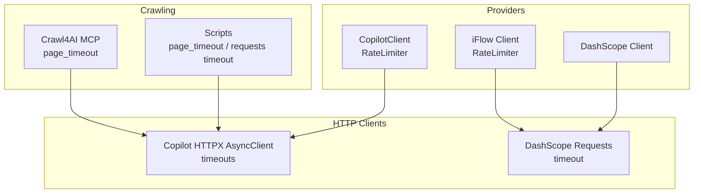
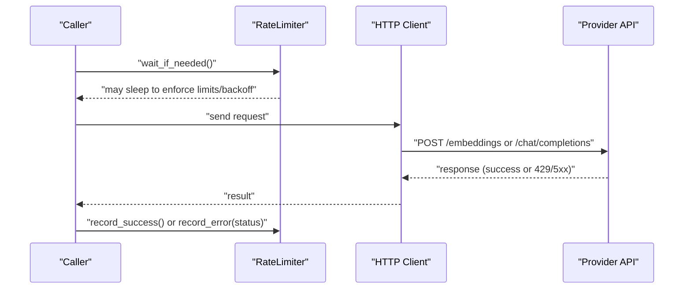
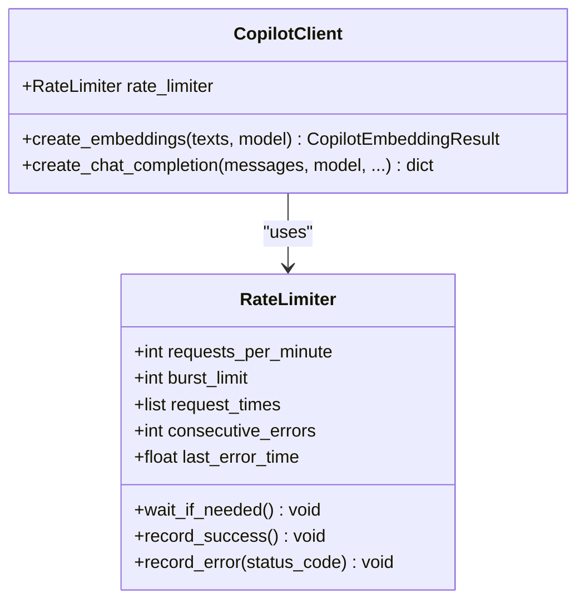
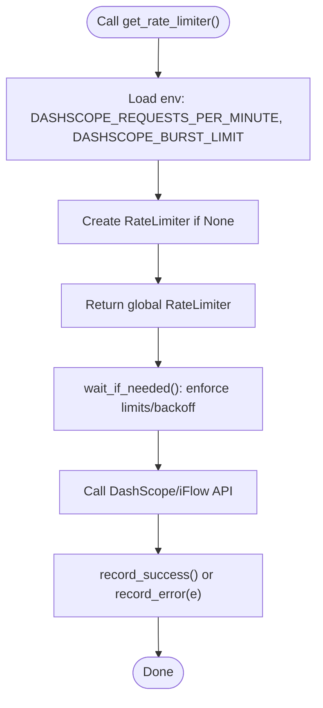
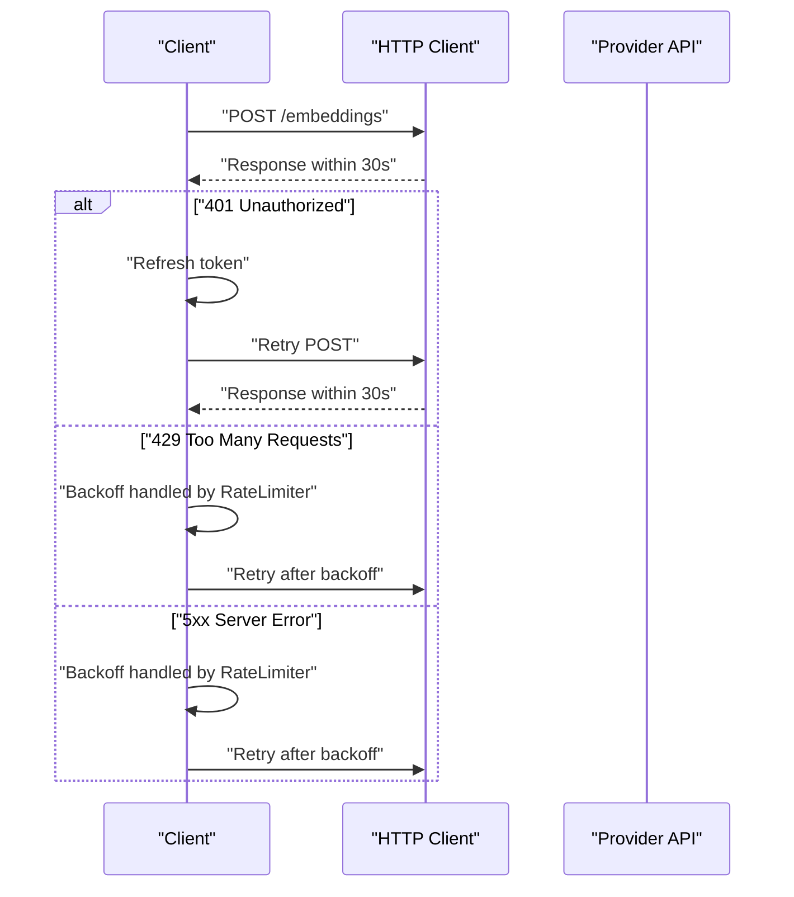
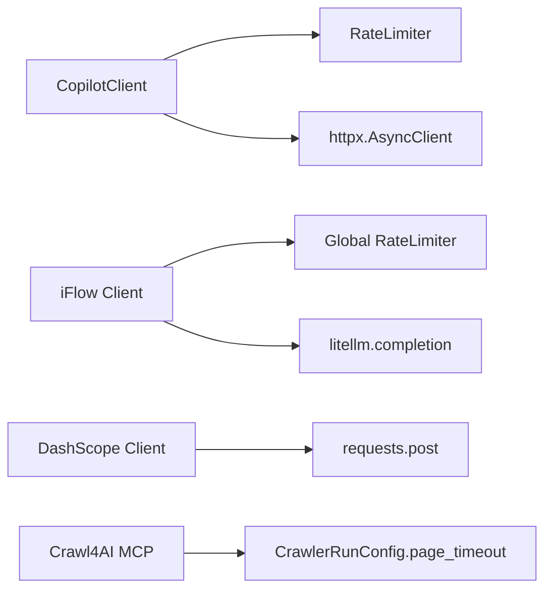

# Rate Limiting and Timeouts

<cite>
**Referenced Files in This Document**
- [copilot_client.py](file://src/copilot_client.py)
- [iflow_client.py](file://src/iflow_client.py)
- [test_rate_limiting.py](file://tests/test_rate_limiting.py)
- [crawl4ai_mcp.py](file://src/crawl4ai_mcp.py)
- [crawl_local_files.py](file://scripts/crawl_local_files.py)
- [download_pages_locally.py](file://scripts/download_pages_locally.py)
- [dashscope_client.py](file://src/dashscope_client.py)
- [mcp.json](file://mcp.json)
</cite>

## Table of Contents
1. [Introduction](#introduction)
2. [Project Structure](#project-structure)
3. [Core Components](#core-components)
4. [Architecture Overview](#architecture-overview)
5. [Detailed Component Analysis](#detailed-component-analysis)
6. [Dependency Analysis](#dependency-analysis)
7. [Performance Considerations](#performance-considerations)
8. [Troubleshooting Guide](#troubleshooting-guide)
9. [Conclusion](#conclusion)
10. [Appendices](#appendices)

## Introduction
This document explains how the system enforces request throttling and timeouts for crawling and querying, covering per-client and global limits, 429 responses, and environment-driven configuration. It also shows how to configure retry logic and timeout thresholds, and provides best practices for production deployments under high concurrency.

## Project Structure
The rate limiting and timeout mechanisms are implemented across several modules:
- Per-client rate limiting for GitHub Copilot and DashScope/iFlow providers
- Global rate limiter instances configured via environment variables
- HTTP client timeouts for embedding and chat completion calls
- Crawler-level timeouts for long-running page fetches
- Test coverage validating rate limiting behavior and backoff

**Diagram sources**
- [copilot_client.py](file://src/copilot_client.py#L183-L260)
- [copilot_client.py](file://src/copilot_client.py#L314-L384)
- [iflow_client.py](file://src/iflow_client.py#L106-L184)
- [dashscope_client.py](file://src/dashscope_client.py#L56-L56)
- [crawl4ai_mcp.py](file://src/crawl4ai_mcp.py#L690-L708)
- [crawl_local_files.py](file://scripts/crawl_local_files.py#L116-L116)
- [download_pages_locally.py](file://scripts/download_pages_locally.py#L27-L27)

**Section sources**
- [copilot_client.py](file://src/copilot_client.py#L183-L260)
- [copilot_client.py](file://src/copilot_client.py#L314-L384)
- [iflow_client.py](file://src/iflow_client.py#L106-L184)
- [dashscope_client.py](file://src/dashscope_client.py#L56-L56)
- [crawl4ai_mcp.py](file://src/crawl4ai_mcp.py#L690-L708)
- [crawl_local_files.py](file://scripts/crawl_local_files.py#L116-L116)
- [download_pages_locally.py](file://scripts/download_pages_locally.py#L27-L27)

## Core Components
- RateLimiter for GitHub Copilot:
  - Enforces requests-per-minute and burst protection (per 10 seconds)
  - Exponential backoff on 429 and 5xx errors
  - Records successes and errors to adjust backoff
  - Configured via environment variable COPILOT_REQUESTS_PER_MINUTE
- RateLimiter for DashScope/iFlow:
  - Global instance created from environment variables DASHSCOPE_REQUESTS_PER_MINUTE and DASHSCOPE_BURST_LIMIT
  - Synchronous wait for throttling and backoff
- HTTP timeouts:
  - Embeddings: 30 seconds
  - Chat completions: 60 seconds
  - DashScope post: 30 seconds
  - Requests.get in scripts: 30 seconds
- Crawler timeouts:
  - Static content mode: page_timeout 10 seconds
  - Local scripts: page_timeout 3 seconds and requests.get timeout 30 seconds

**Section sources**
- [copilot_client.py](file://src/copilot_client.py#L19-L90)
- [copilot_client.py](file://src/copilot_client.py#L111-L127)
- [copilot_client.py](file://src/copilot_client.py#L213-L240)
- [copilot_client.py](file://src/copilot_client.py#L347-L380)
- [iflow_client.py](file://src/iflow_client.py#L11-L27)
- [iflow_client.py](file://src/iflow_client.py#L90-L104)
- [dashscope_client.py](file://src/dashscope_client.py#L56-L56)
- [crawl4ai_mcp.py](file://src/crawl4ai_mcp.py#L690-L708)
- [crawl_local_files.py](file://scripts/crawl_local_files.py#L116-L116)
- [download_pages_locally.py](file://scripts/download_pages_locally.py#L27-L27)

## Architecture Overview
The system applies rate limiting at two layers:
- Per-client rate limiting inside provider clients (Copilot and DashScope/iFlow)
- Global rate limiting via a shared global limiter for DashScope/iFlow

HTTP timeouts are set per endpoint call. Crawler-level timeouts apply when fetching pages.

**Diagram sources**
- [copilot_client.py](file://src/copilot_client.py#L36-L70)
- [copilot_client.py](file://src/copilot_client.py#L213-L240)
- [copilot_client.py](file://src/copilot_client.py#L347-L380)
- [iflow_client.py](file://src/iflow_client.py#L28-L63)
- [iflow_client.py](file://src/iflow_client.py#L141-L160)

## Detailed Component Analysis

### GitHub Copilot Rate Limiter
- Implements requests-per-minute and burst protection (last 10 seconds)
- Exponential backoff capped at 30 seconds for consecutive 429/5xx errors
- Uses environment variable COPILOT_REQUESTS_PER_MINUTE to configure requests-per-minute
- Applies timeouts of 30 seconds for embeddings and 60 seconds for chat completions

**Diagram sources**
- [copilot_client.py](file://src/copilot_client.py#L19-L90)
- [copilot_client.py](file://src/copilot_client.py#L183-L384)

**Section sources**
- [copilot_client.py](file://src/copilot_client.py#L19-L90)
- [copilot_client.py](file://src/copilot_client.py#L111-L127)
- [copilot_client.py](file://src/copilot_client.py#L213-L240)
- [copilot_client.py](file://src/copilot_client.py#L347-L380)

### DashScope/iFlow Rate Limiter
- Global limiter instance created from environment variables DASHSCOPE_REQUESTS_PER_MINUTE and DASHSCOPE_BURST_LIMIT
- Synchronous wait_if_needed() with the same logic as Copilot’s limiter
- Exponential backoff for rate limit and server errors
- Used by iFlow client via get_rate_limiter()

**Diagram sources**
- [iflow_client.py](file://src/iflow_client.py#L90-L104)
- [iflow_client.py](file://src/iflow_client.py#L11-L27)
- [iflow_client.py](file://src/iflow_client.py#L28-L63)

**Section sources**
- [iflow_client.py](file://src/iflow_client.py#L90-L104)
- [iflow_client.py](file://src/iflow_client.py#L11-L27)
- [iflow_client.py](file://src/iflow_client.py#L28-L63)

### HTTP Timeouts and Retry Behavior
- Embeddings timeout: 30 seconds
- Chat completions timeout: 60 seconds
- DashScope post timeout: 30 seconds
- Requests.get in scripts: 30 seconds
- Crawler page_timeout: 10 seconds in static content mode; scripts use 3 seconds
- Token refresh and retry on 401; no automatic retry on 429/5xx beyond backoff

**Diagram sources**
- [copilot_client.py](file://src/copilot_client.py#L213-L240)
- [copilot_client.py](file://src/copilot_client.py#L347-L380)
- [dashscope_client.py](file://src/dashscope_client.py#L56-L56)
- [crawl4ai_mcp.py](file://src/crawl4ai_mcp.py#L690-L708)
- [crawl_local_files.py](file://scripts/crawl_local_files.py#L116-L116)
- [download_pages_locally.py](file://scripts/download_pages_locally.py#L27-L27)

**Section sources**
- [copilot_client.py](file://src/copilot_client.py#L213-L240)
- [copilot_client.py](file://src/copilot_client.py#L347-L380)
- [dashscope_client.py](file://src/dashscope_client.py#L56-L56)
- [crawl4ai_mcp.py](file://src/crawl4ai_mcp.py#L690-L708)
- [crawl_local_files.py](file://scripts/crawl_local_files.py#L116-L116)
- [download_pages_locally.py](file://scripts/download_pages_locally.py#L27-L27)

### Interpreting 429 Responses
- The system treats 429 as a rate-limit error and increments consecutive_errors for exponential backoff
- Backoff grows exponentially up to a cap of 30 seconds
- On 5xx server errors, the same backoff logic applies
- There is no automatic retry on 429/5xx beyond the backoff wait enforced by the limiter

**Section sources**
- [copilot_client.py](file://src/copilot_client.py#L76-L89)
- [iflow_client.py](file://src/iflow_client.py#L68-L84)

### Environment Variables and Configuration
- COPILOT_REQUESTS_PER_MINUTE: requests-per-minute for Copilot client
- DASHSCOPE_REQUESTS_PER_MINUTE: requests-per-minute for DashScope/iFlow global limiter
- DASHSCOPE_BURST_LIMIT: burst limit for DashScope/iFlow global limiter
- IFLOW_API_KEY: required for iFlow client
- IFLOW_API_BASE: optional base URL for iFlow/DashScope
- GITHUB_TOKEN: required for Copilot client
- CRAWL_STATIC_CONTENT_ONLY: toggles static content crawling mode with page_timeout=10000 ms

**Section sources**
- [copilot_client.py](file://src/copilot_client.py#L111-L127)
- [iflow_client.py](file://src/iflow_client.py#L90-L104)
- [iflow_client.py](file://src/iflow_client.py#L129-L134)
- [crawl4ai_mcp.py](file://src/crawl4ai_mcp.py#L690-L708)

### Test Coverage for Rate Limiting
- Validates basic rate limiting, burst protection, and exponential backoff on 429
- Demonstrates Copilot client rate limiting with real API calls when credentials are available

**Section sources**
- [test_rate_limiting.py](file://tests/test_rate_limiting.py#L21-L46)
- [test_rate_limiting.py](file://tests/test_rate_limiting.py#L48-L67)
- [test_rate_limiting.py](file://tests/test_rate_limiting.py#L110-L134)
- [test_rate_limiting.py](file://tests/test_rate_limiting.py#L136-L172)

## Dependency Analysis
- CopilotClient depends on RateLimiter and uses HTTPX AsyncClient with timeouts
- iFlow client depends on a global RateLimiter instance and uses LiteLLM/DashScope
- DashScope client uses requests with a timeout
- Crawler uses CrawlerRunConfig with page_timeout for long-running fetches

**Diagram sources**
- [copilot_client.py](file://src/copilot_client.py#L183-L260)
- [copilot_client.py](file://src/copilot_client.py#L314-L384)
- [iflow_client.py](file://src/iflow_client.py#L106-L184)
- [dashscope_client.py](file://src/dashscope_client.py#L56-L56)
- [crawl4ai_mcp.py](file://src/crawl4ai_mcp.py#L690-L708)

**Section sources**
- [copilot_client.py](file://src/copilot_client.py#L183-L260)
- [copilot_client.py](file://src/copilot_client.py#L314-L384)
- [iflow_client.py](file://src/iflow_client.py#L106-L184)
- [dashscope_client.py](file://src/dashscope_client.py#L56-L56)
- [crawl4ai_mcp.py](file://src/crawl4ai_mcp.py#L690-L708)

## Performance Considerations
- Use lower requests-per-minute and burst limits for high-concurrency environments to avoid 429 storms
- Increase timeouts cautiously; longer timeouts increase resource usage and risk of cascading delays
- Prefer batching embeddings to reduce total request volume
- Monitor backoff behavior; if frequent 429s occur, reduce concurrency and tune environment variables

[No sources needed since this section provides general guidance]

## Troubleshooting Guide
Common symptoms and remedies:
- Frequent 429 responses:
  - Reduce COPILOT_REQUESTS_PER_MINUTE or DASHSCOPE_REQUESTS_PER_MINUTE
  - Ensure burst_limit is appropriate for workload bursts
  - Allow exponential backoff to recover
- Persistent 5xx errors:
  - Expect backoff; verify provider health and retry later
- Slow or hanging requests:
  - Adjust timeouts (embeddings 30s, chat 60s, crawler page_timeout 10s)
  - Check network connectivity and proxy settings
- Authentication failures:
  - Ensure GITHUB_TOKEN is set for Copilot
  - Ensure IFLOW_API_KEY is set for iFlow

**Section sources**
- [copilot_client.py](file://src/copilot_client.py#L213-L240)
- [copilot_client.py](file://src/copilot_client.py#L347-L380)
- [iflow_client.py](file://src/iflow_client.py#L129-L134)
- [crawl4ai_mcp.py](file://src/crawl4ai_mcp.py#L690-L708)

## Conclusion
The system enforces robust per-client and global rate limiting with exponential backoff and burst protection. HTTP and crawler timeouts are configurable via environment variables and code defaults. For production, tune environment variables to match provider quotas, monitor 429 occurrences, and adjust concurrency accordingly.

[No sources needed since this section summarizes without analyzing specific files]

## Appendices

### Best Practices for Production Deployment
- Set COPILOT_REQUESTS_PER_MINUTE and DASHSCOPE_REQUESTS_PER_MINUTE conservatively to avoid throttling
- Use DASHSCOPE_BURST_LIMIT to smooth short bursts
- Keep timeouts reasonable; increase only when necessary
- Implement external retry loops around embedding generation if needed, since the built-in limiter does not auto-retry on 429/5xx beyond backoff
- For high concurrency, stagger start times and batch requests to reduce peak load

[No sources needed since this section provides general guidance]

### Example Configuration References
- mcp.json transport and URL for SSE server
  - [mcp.json](file://mcp.json#L1-L9)

**Section sources**
- [mcp.json](file://mcp.json#L1-L9)