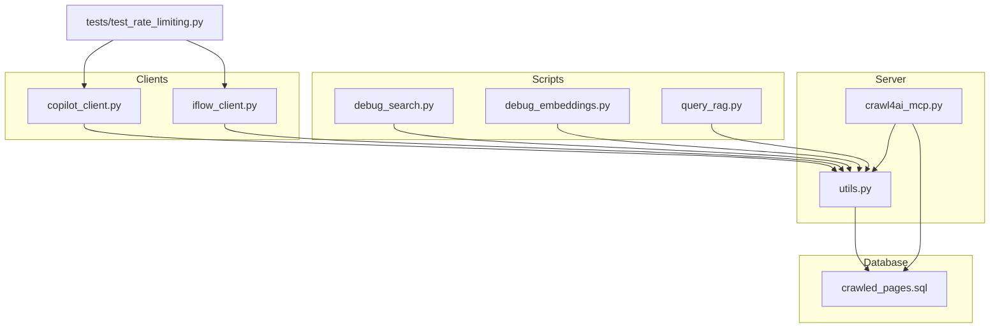
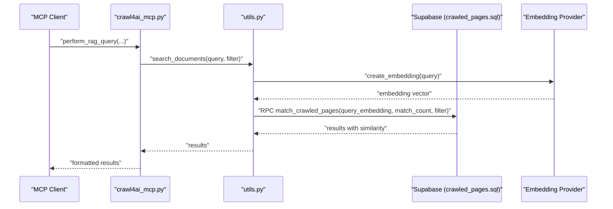
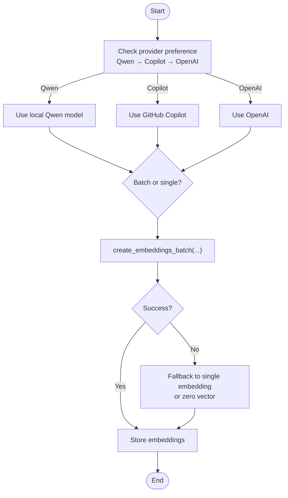
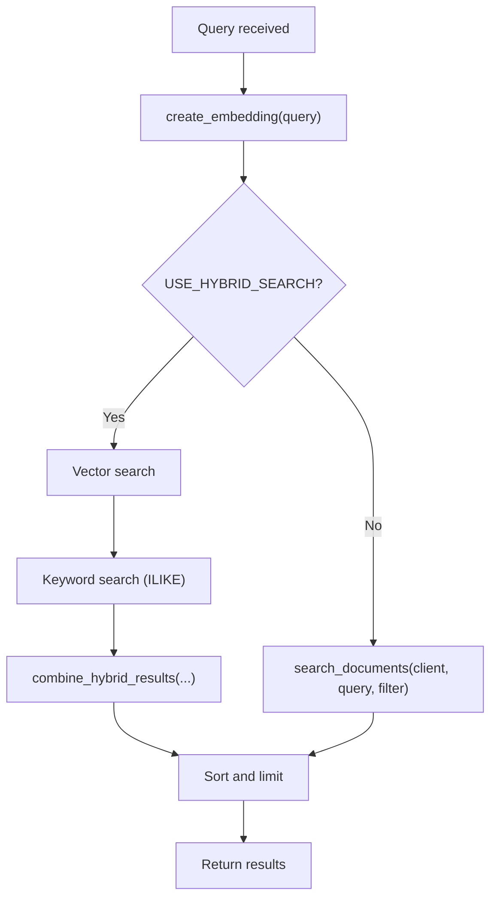
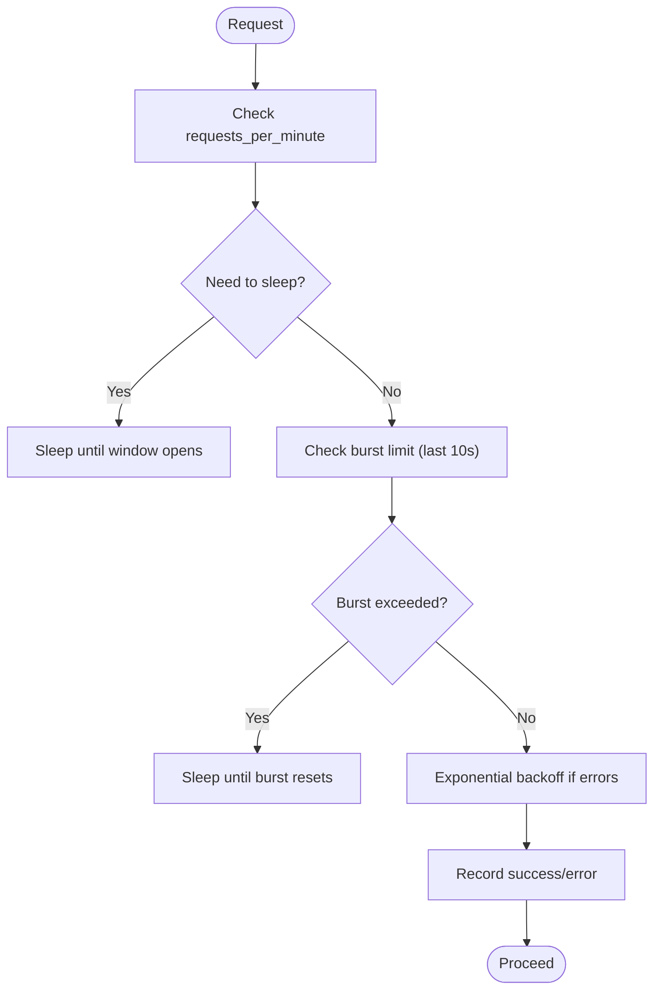
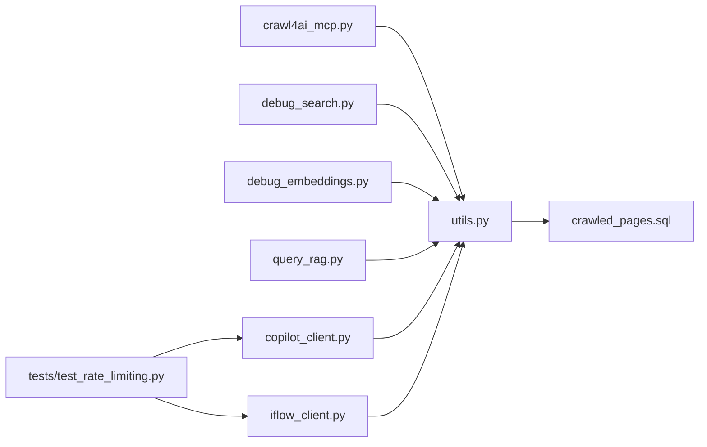

# Troubleshooting Guide

<cite>
**Referenced Files in This Document**
- [README.md](file://README.md)
- [src/utils.py](file://src/utils.py)
- [src/crawl4ai_mcp.py](file://src/crawl4ai_mcp.py)
- [scripts/debug_search.py](file://scripts/debug_search.py)
- [scripts/debug_embeddings.py](file://scripts/debug_embeddings.py)
- [scripts/query_rag.py](file://scripts/query_rag.py)
- [crawled_pages.sql](file://crawled_pages.sql)
- [tests/test_rate_limiting.py](file://tests/test_rate_limiting.py)
- [src/copilot_client.py](file://src/copilot_client.py)
- [src/iflow_client.py](file://src/iflow_client.py)
</cite>

## Table of Contents
1. [Introduction](#introduction)
2. [Project Structure](#project-structure)
3. [Core Components](#core-components)
4. [Architecture Overview](#architecture-overview)
5. [Detailed Component Analysis](#detailed-component-analysis)
6. [Dependency Analysis](#dependency-analysis)
7. [Performance Considerations](#performance-considerations)
8. [Troubleshooting Guide](#troubleshooting-guide)
9. [Conclusion](#conclusion)
10. [Appendices](#appendices)

## Introduction
This Troubleshooting Guide consolidates common issues and their resolutions across installation, crawling, embedding generation, database connectivity, and query performance. It includes diagnostic steps using provided debug scripts and outlines rate limiting, timeouts, and memory usage considerations. Known limitations and workarounds are documented, along with logging best practices and where to find relevant error messages.

## Project Structure
The repository organizes functionality into:
- Core server and utilities: server lifecycle, embedding generation, search, and RAG orchestration
- Scripts: debug and query helpers for diagnostics and testing
- Database schema: Supabase tables and vector search functions
- Tests: rate limiting behavior validation

**Diagram sources**
- [src/crawl4ai_mcp.py](file://src/crawl4ai_mcp.py#L1-L120)
- [src/utils.py](file://src/utils.py#L1-L120)
- [scripts/debug_search.py](file://scripts/debug_search.py#L1-L40)
- [scripts/debug_embeddings.py](file://scripts/debug_embeddings.py#L1-L40)
- [scripts/query_rag.py](file://scripts/query_rag.py#L1-L40)
- [crawled_pages.sql](file://crawled_pages.sql#L1-L40)
- [src/copilot_client.py](file://src/copilot_client.py#L40-L70)
- [src/iflow_client.py](file://src/iflow_client.py#L39-L69)
- [tests/test_rate_limiting.py](file://tests/test_rate_limiting.py#L1-L40)

**Section sources**
- [README.md](file://README.md#L409-L482)
- [src/crawl4ai_mcp.py](file://src/crawl4ai_mcp.py#L1-L120)
- [src/utils.py](file://src/utils.py#L1-L120)
- [scripts/debug_search.py](file://scripts/debug_search.py#L1-L40)
- [scripts/debug_embeddings.py](file://scripts/debug_embeddings.py#L1-L40)
- [scripts/query_rag.py](file://scripts/query_rag.py#L1-L40)
- [crawled_pages.sql](file://crawled_pages.sql#L1-L40)
- [src/copilot_client.py](file://src/copilot_client.py#L40-L70)
- [src/iflow_client.py](file://src/iflow_client.py#L39-L69)
- [tests/test_rate_limiting.py](file://tests/test_rate_limiting.py#L1-L40)

## Core Components
- Server lifecycle and tools: manages crawler, Supabase client, optional reranking, and knowledge graph components; prints configuration summary and readiness message
- Utilities: embedding generation (local Qwen, Copilot, OpenAI), chat completions, Supabase client creation, batch embedding creation, document insertion, search, and code example extraction/summarization
- Debug scripts: inspect database state, embeddings, and direct RPC calls for vector search
- Query script: multi-source search across documentation and code examples, with hybrid search support
- Database schema: tables for sources, documentation chunks, and code examples, plus vector search functions and indexes
- Rate limiting clients: Copilot and DashScope-style clients with per-minute and burst protections and exponential backoff

**Section sources**
- [src/crawl4ai_mcp.py](file://src/crawl4ai_mcp.py#L130-L293)
- [src/utils.py](file://src/utils.py#L121-L317)
- [scripts/debug_search.py](file://scripts/debug_search.py#L1-L40)
- [scripts/debug_embeddings.py](file://scripts/debug_embeddings.py#L1-L40)
- [scripts/query_rag.py](file://scripts/query_rag.py#L1-L40)
- [crawled_pages.sql](file://crawled_pages.sql#L46-L80)
- [src/copilot_client.py](file://src/copilot_client.py#L40-L70)
- [src/iflow_client.py](file://src/iflow_client.py#L39-L69)

## Architecture Overview
The system orchestrates crawling, chunking, embedding, and storage, then serves vector search and hybrid search via Supabase functions. Optional reranking and knowledge graph components can be enabled.

**Diagram sources**
- [src/crawl4ai_mcp.py](file://src/crawl4ai_mcp.py#L364-L429)
- [src/utils.py](file://src/utils.py#L549-L587)
- [crawled_pages.sql](file://crawled_pages.sql#L46-L80)

## Detailed Component Analysis

### Embedding Generation and Storage
- Provider selection order: local Qwen → Copilot → OpenAI (fallback)
- Batch embedding creation with exponential backoff and per-request fallback
- Document insertion with batching, contextual embeddings (optional), and retry logic
- Code example embedding with validation and fallback to single embedding

**Diagram sources**
- [src/utils.py](file://src/utils.py#L121-L197)
- [src/utils.py](file://src/utils.py#L279-L317)
- [src/utils.py](file://src/utils.py#L383-L548)
- [src/utils.py](file://src/utils.py#L719-L800)

**Section sources**
- [src/utils.py](file://src/utils.py#L121-L197)
- [src/utils.py](file://src/utils.py#L279-L317)
- [src/utils.py](file://src/utils.py#L383-L548)
- [src/utils.py](file://src/utils.py#L719-L800)

### Search and Hybrid Retrieval
- Vector search via Supabase RPC with optional metadata filter and source filter
- Hybrid search combines vector and keyword results, boosting items present in both
- Multi-source search aggregates results across source IDs

**Diagram sources**
- [src/utils.py](file://src/utils.py#L549-L587)
- [src/crawl4ai_mcp.py](file://src/crawl4ai_mcp.py#L302-L363)
- [src/crawl4ai_mcp.py](file://src/crawl4ai_mcp.py#L364-L429)

**Section sources**
- [src/utils.py](file://src/utils.py#L549-L587)
- [src/crawl4ai_mcp.py](file://src/crawl4ai_mcp.py#L302-L363)
- [src/crawl4ai_mcp.py](file://src/crawl4ai_mcp.py#L364-L429)

### Rate Limiting and Backoff
- Requests per minute and burst protection (per 10 seconds)
- Exponential backoff on consecutive errors (max 30 seconds)
- Environment-configurable limits and client-side waiting logic

**Diagram sources**
- [src/copilot_client.py](file://src/copilot_client.py#L42-L70)
- [src/iflow_client.py](file://src/iflow_client.py#L39-L69)
- [tests/test_rate_limiting.py](file://tests/test_rate_limiting.py#L1-L172)

**Section sources**
- [src/copilot_client.py](file://src/copilot_client.py#L42-L70)
- [src/iflow_client.py](file://src/iflow_client.py#L39-L69)
- [tests/test_rate_limiting.py](file://tests/test_rate_limiting.py#L1-L172)

## Dependency Analysis
- Server depends on utilities for embedding, search, and database operations
- Debug and query scripts depend on utilities and environment configuration
- Database schema defines tables, indexes, and RPC functions used by utilities
- Rate limiting clients are independent but integrate with embedding/chat completion flows

**Diagram sources**
- [src/crawl4ai_mcp.py](file://src/crawl4ai_mcp.py#L1-L120)
- [src/utils.py](file://src/utils.py#L1-L120)
- [scripts/debug_search.py](file://scripts/debug_search.py#L1-L40)
- [scripts/debug_embeddings.py](file://scripts/debug_embeddings.py#L1-L40)
- [scripts/query_rag.py](file://scripts/query_rag.py#L1-L40)
- [crawled_pages.sql](file://crawled_pages.sql#L1-L40)
- [src/copilot_client.py](file://src/copilot_client.py#L40-L70)
- [src/iflow_client.py](file://src/iflow_client.py#L39-L69)
- [tests/test_rate_limiting.py](file://tests/test_rate_limiting.py#L1-L40)

**Section sources**
- [src/crawl4ai_mcp.py](file://src/crawl4ai_mcp.py#L1-L120)
- [src/utils.py](file://src/utils.py#L1-L120)
- [scripts/debug_search.py](file://scripts/debug_search.py#L1-L40)
- [scripts/debug_embeddings.py](file://scripts/debug_embeddings.py#L1-L40)
- [scripts/query_rag.py](file://scripts/query_rag.py#L1-L40)
- [crawled_pages.sql](file://crawled_pages.sql#L1-L40)
- [src/copilot_client.py](file://src/copilot_client.py#L40-L70)
- [src/iflow_client.py](file://src/iflow_client.py#L39-L69)
- [tests/test_rate_limiting.py](file://tests/test_rate_limiting.py#L1-L40)

## Performance Considerations
- Startup time dominated by model downloads and loading; subsequent starts are faster
- Disable unused features (reranking, knowledge graph, local embeddings) to reduce startup time
- Use SSE transport for better connection reliability during initialization
- Parallel processing for contextual embeddings and code example summaries; tune worker counts and batch sizes
- Memory usage influenced by chunk size, batch size, and concurrent workers; reduce max_concurrent and chunk_size if encountering memory errors

[No sources needed since this section provides general guidance]

## Troubleshooting Guide

### Installation Failures
Symptoms
- Dependency installation errors, especially on restricted systems without sudo
- Playwright browser dependency errors
- Docker build or runtime permission issues

Root causes
- Missing system-level dependencies for Playwright
- Restricted environment preventing package installation
- Docker not installed or insufficient privileges

Diagnostic steps
- Use the provided installation script for restricted environments
- Verify environment variables and .env file presence
- Confirm Docker installation and permissions if using containerized deployment

Solutions
- Use the installation script to install Python dependencies and Playwright browsers
- Request system administrator to install Playwright system dependencies
- Prefer Docker for production deployments in restricted environments

Known limitations and workarounds
- Some system-level Playwright dependencies require sudo; use Docker or request admin assistance
- Alternative: use uv with virtual environment and install dependencies without sudo

Logging and error locations
- Installation script logs and error messages during dependency installation
- Docker build logs for containerization issues

**Section sources**
- [README.md](file://README.md#L674-L714)

### Crawling Errors
Symptoms
- Excessively large content due to JavaScript redirects
- Timeouts or incomplete page captures
- Mixed static/dynamic content behavior

Root causes
- JavaScript redirects causing unexpected content expansion
- Page timeout thresholds insufficient for complex pages
- Inconsistent behavior when mixing static and dynamic crawling modes

Diagnostic steps
- Use the static-only mode to capture original page content
- Inspect precedence of disable_javascript parameter, script CLI flag, and environment variable
- Review crawl configuration and page timeout settings

Solutions
- Set disable_javascript to true for static-only content
- Increase page_timeout for complex pages
- Prefer explicit per-request overrides when needed

Known limitations and workarounds
- Static-only mode prevents dynamic content loading; choose mode based on desired content
- For recursive crawling, prefer sitemaps or text files when available

Logging and error locations
- Server prints crawling mode and environment settings
- Crawler run configuration applied per request

**Section sources**
- [README.md](file://README.md#L483-L532)
- [src/crawl4ai_mcp.py](file://src/crawl4ai_mcp.py#L682-L712)

### Embedding Generation Issues
Symptoms
- All-zero embeddings or null embeddings
- Missing embeddings in database
- Errors during embedding creation or batch processing

Root causes
- Local Qwen model not available or failed to load
- API key/token errors for external providers
- Network issues or rate limiting from providers
- Invalid or empty input texts

Diagnostic steps
- Use debug_embeddings.py to check embedding statistics and sample records
- Verify environment variables for provider selection
- Confirm embedding dimensionality and non-zero checks

Solutions
- Ensure local Qwen model is available or switch to Copilot/OpenAI
- Provide valid API keys/tokens and verify connectivity
- Retry with smaller batch sizes and monitor rate limiting

Known limitations and workarounds
- Local Qwen model fallback returns zero vectors; prefer cloud providers if local model fails
- Batch embedding creation falls back to individual embeddings on partial failures

Logging and error locations
- Embedding creation logs and fallback behavior
- Direct RPC calls to Supabase for embedding validation

**Section sources**
- [scripts/debug_embeddings.py](file://scripts/debug_embeddings.py#L1-L40)
- [src/utils.py](file://src/utils.py#L121-L197)
- [src/utils.py](file://src/utils.py#L279-L317)

### Database Connectivity Problems
Symptoms
- Unable to connect to Supabase
- Missing tables or functions
- Vector search returns no results

Root causes
- Incorrect SUPABASE_URL or SUPABASE_SERVICE_KEY
- Missing pgvector extension or missing tables/functions
- Indexes or policies not created

Diagnostic steps
- Use debug_search.py to verify database state and embeddings
- Confirm Supabase client initialization and environment variables
- Run the database setup script to create tables, indexes, and functions

Solutions
- Correct .env variables for Supabase credentials
- Execute the SQL script to create tables and functions
- Re-run setup if tables were dropped or altered

Known limitations and workarounds
- Public read policies must be enabled for search functions
- Ensure vector index exists for cosine similarity

Logging and error locations
- Supabase client creation raises explicit errors if credentials missing
- Database functions and indexes defined in SQL script

**Section sources**
- [scripts/debug_search.py](file://scripts/debug_search.py#L1-L40)
- [src/utils.py](file://src/utils.py#L106-L120)
- [crawled_pages.sql](file://crawled_pages.sql#L1-L45)
- [crawled_pages.sql](file://crawled_pages.sql#L46-L80)

### Query Performance Bottlenecks
Symptoms
- Slow search results or timeouts
- Poor relevance without reranking
- Excessive memory usage during ingestion

Root causes
- Large result sets or insufficient filtering
- Missing reranking model
- High batch sizes and concurrent workers
- Missing indexes or inefficient filters

Diagnostic steps
- Use query_rag.py to test hybrid search and reranking
- Verify source filtering and metadata filters
- Monitor memory usage and adjust batch_size and max_workers

Solutions
- Enable USE_RERANKING and ensure reranking model loads
- Use source_id filters to narrow search scope
- Reduce batch_size and max_workers to manage memory
- Ensure indexes exist for metadata and source_id

Known limitations and workarounds
- Reranking adds latency; use judiciously for complex queries
- Multi-source search aggregates results; consider filtering to reduce cost

Logging and error locations
- Server prints configuration summary and readiness
- Hybrid search combines vector and keyword results with boost logic

**Section sources**
- [scripts/query_rag.py](file://scripts/query_rag.py#L1-L40)
- [src/crawl4ai_mcp.py](file://src/crawl4ai_mcp.py#L302-L363)
- [src/crawl4ai_mcp.py](file://src/crawl4ai_mcp.py#L430-L467)
- [README.md](file://README.md#L471-L482)

### Rate Limiting, Timeout Configurations, and Memory Usage
Rate limiting
- Requests per minute and burst protection enforced by clients
- Exponential backoff on consecutive errors (max 30 seconds)
- Configure via environment variables for Copilot and DashScope clients

Timeout configurations
- Crawler run configuration supports page_timeout and wait_for selectors
- Static-only mode reduces page load time expectations

Memory usage
- Parallel processing for contextual embeddings and code summaries
- Batch insertion with retry logic; tune batch_size and max_workers
- Reduce max_concurrent and chunk_size if encountering memory errors

Diagnostic steps
- Use debug_search.py and debug_embeddings.py to validate embeddings and RPC calls
- Monitor server logs for configuration summary and readiness

Solutions
- Adjust rate limiting and burst parameters based on provider quotas
- Tune crawler timeouts and crawling mode
- Reduce concurrency and batch sizes to fit memory constraints

Known limitations and workarounds
- Exponential backoff caps at 30 seconds
- Static-only mode avoids heavy JS execution

Logging and error locations
- Rate limiter prints waiting times and backoff durations
- Server prints configuration summary and readiness message

**Section sources**
- [src/copilot_client.py](file://src/copilot_client.py#L42-L70)
- [src/iflow_client.py](file://src/iflow_client.py#L39-L69)
- [src/crawl4ai_mcp.py](file://src/crawl4ai_mcp.py#L682-L712)
- [README.md](file://README.md#L471-L482)

### Using Debug Scripts
- debug_search.py
  - Checks database records and embeddings
  - Tests direct RPC calls to match_crawled_pages
  - Validates embedding creation and non-null checks
- debug_embeddings.py
  - Counts null vs non-null embeddings
  - Attempts direct searches with various filters
  - Verifies function callable status

Diagnostic steps
- Load environment variables and run scripts from project root
- Review printed statistics and RPC results
- Compare embedding dimensions and zero-vector indicators

Solutions
- Fix provider configuration if embeddings are zero or null
- Adjust filters and match_count for better recall
- Re-run database setup if functions missing

**Section sources**
- [scripts/debug_search.py](file://scripts/debug_search.py#L1-L40)
- [scripts/debug_embeddings.py](file://scripts/debug_embeddings.py#L1-L40)
- [crawled_pages.sql](file://crawled_pages.sql#L46-L80)

## Conclusion
This guide consolidates actionable troubleshooting steps across installation, crawling, embedding generation, database connectivity, and performance. Use the provided debug and query scripts to diagnose issues quickly, adjust rate limiting and timeouts according to provider quotas, and tune memory usage by reducing concurrency and batch sizes. For persistent issues, consult server logs, database setup, and environment variables.

## Appendices

### Logging Best Practices
- Enable verbose output during testing and diagnostics
- Capture server readiness logs to confirm initialization
- Log embedding provider selection and model loading status
- Record rate limiter actions and backoff durations

Where to find relevant error messages
- Server initialization logs for configuration summary and readiness
- Utility functions for embedding creation and database operations
- Rate limiting clients for waiting and backoff messages

**Section sources**
- [src/crawl4ai_mcp.py](file://src/crawl4ai_mcp.py#L221-L269)
- [src/utils.py](file://src/utils.py#L121-L197)
- [src/copilot_client.py](file://src/copilot_client.py#L42-L70)
- [src/iflow_client.py](file://src/iflow_client.py#L39-L69)